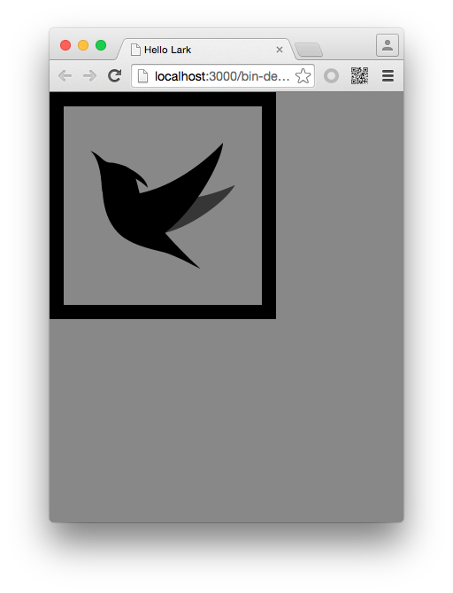
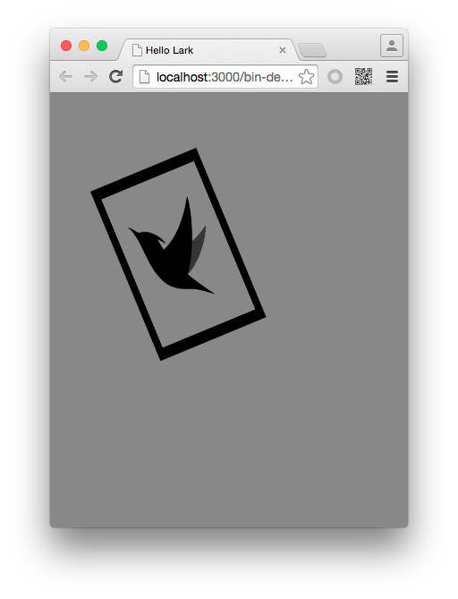

#Lark Core 编程指南 - 示例:对现实对象应用矩阵变换


在舞台中添加一张位图，通过对其 matrix 属性的修改，来改变位图的样式。

```
class Main extends lark.Sprite {
    constructor() {
        super();

        var imageLoader = new lark.ImageLoader();
        imageLoader.once(lark.Event.COMPLETE,this.onLoaded,this);
        imageLoader.load( "resources/lark.png");
    }
    private onLoaded(event:lark.Event)
    {
        var larkBitmapData = event.target.data;
        var bitmap = new lark.Bitmap( larkBitmapData );
        this.addChild( bitmap );
    }
}
```

运行后效果如图：




针对Bitmap对象的matrix属性进行设置。


```
class Main extends lark.Sprite {
    constructor() {
        super();

        var imageLoader = new lark.ImageLoader();
        imageLoader.once(lark.Event.COMPLETE,this.onLoaded,this);
        imageLoader.load( "resources/lark.png");
    }
    private onLoaded(event:lark.Event)
    {
        var larkBitmapData = event.target.data;
        var bitmap = new lark.Bitmap( larkBitmapData );
        this.addChild( bitmap );

        var matrix = lark.Matrix.create();
        matrix.scale(0.5, 0.8);
        matrix.rotate( Math.PI * (-45 / 360) );
        matrix.translate( 45, 110 );

        img.matrix = matrix;
    }
}
```
注意：直接获取DisplayObject.matrix引用并修改它是无效的，显示对象的matrix属性必须重新赋值才能生效。

运行后效果如图：


