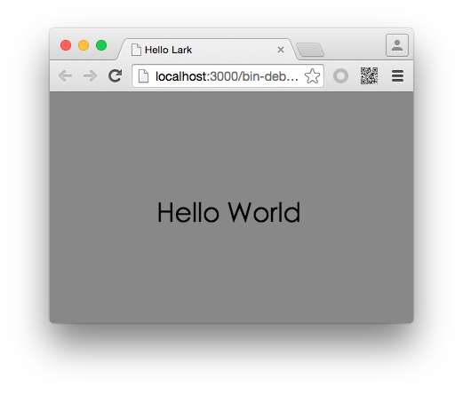

#Lark Core 编程指南 - 显示文本


Lark中普通文本使用 `lark.TextField` 类来实现。这个类继承自 `DisplayObject` 。属于标准的显示对象，你可以使用 `addChild` 方法将一个文本添加到显示列表，使其显示在舞台中。

创建一个文本对象非常简单，代码如下：

```
var text = new lark.TextField("Hello Lark");
text.x = 120;
text.y = 120;
this.addChild(text);
```

我们在创建 `lark.TextField` 对象时，为其传入了一个字符串，该字符串就是文本将要显示的内容。如果在初始化时，没有为其制定文本内容，可以调用其 `text` 属性来进行设置。

```
text.text = "Hello World";
```

运行后效果如图：


