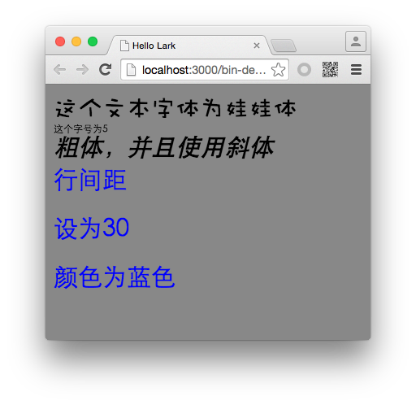

#Lark Core 编程指南 - 设置文本格式


TextField 中包含了大量和样式相关的属性，我们可以通过这些属性的调整来设置文本的不同样式。

下面表格罗列出了一些常用的样式属性，更多属性可以参考 Lark API 文档。

| 属性                    | 描述                                     |
| -----------------------|----------------------------------------- |
| fontFamily             | 要使用的字体的名称                          |
| fontSize               | 文本的字号大小                             |
| bold                   | 是否显示为粗体                             |
| italic                 | 是否显示为斜体                             |
| textAlign              | 文本的水平对齐方式                         |
| verticalAlign          | 文字的垂直对齐方式                          |
| lineSpacing            | 表示行与行之间的垂直间距量                   |
| textColor              | 文本颜色                                  |

下面来看一个实例。

```
class Main extends lark.Sprite {
    constructor() {
        super();
        var t1 = this.createText(10,10, "这个文本字体为娃娃体");
        t1.fontFamily = "Wawati SC";

        var t2 = this.createText(10,50, "这个字号为5");
        t2.fontSize = 5;

        var t3 = this.createText(10, 60,"粗体，并且使用斜体");
        t3.bold = true;
        t3.italic = true;

        var t4 = this.createText(10, 100,"行间距\n设为30\n颜色为蓝色");
        t4.lineSpacing = 30;
        t4.textColor = 0x0000ff;

    }

    private createText(_x:number,_y:number,_text:string):lark.TextField
    {
        var txt:lark.TextField = new lark.TextField();
        txt.x = _x;
        txt.y = _y;
        txt.text = _text;
        this.addChild(txt);
        return txt;
    }
    
}
```

运行后效果如图：




值得主题的两个属性是 `textAlign` 和 `verticalAlign` 文本的水平对齐和垂直对齐方式。其取值需要涉及到另外两个类 `lark.HorizontalAlign` 和 `lark.VerticalAlign` 。

无论是垂直还是水平对齐方式，都会提供三种对齐样式，两端对齐和居中对齐。例如：

```
txt.textAlign = lark.HorizontalAlign.CENTER;
```


