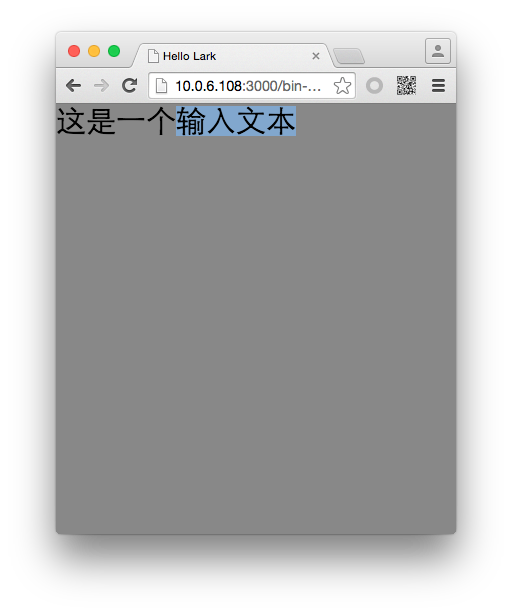

#Lark Core 编程指南 - 捕获文本输入


输入文本 `lark.TextInput` 类继承自 `lark.TextField` 。你可以设置输入文本的样式以及对齐方式。但在 `lark.TextInput` 中，用户可手动的输入文本内容。

来看下面一段代码：

```
var txt = new lark.TextInput();
txt.width = 200;
txt.height = 100;
this.addChild( txt );
```

运行后效果如图：



由于输入文本涉及到用户输入操作，所以在 `lark.TextInput` 中还封装了几个实用的方法用来处理文本的选择操作，请参考下一小结。
