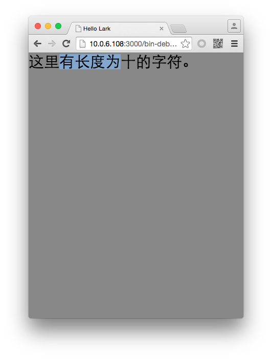

#Lark Core 编程指南 - 处理文本选择


`lark.TextField` 在处理用户选择是提供了几个属性和方法供开发者使用，列表如下：

| 属性/方法                      | 描述                                     |
| ------------------------------|----------------------------------------- |
| selectionActivePosition 属性   | 光标做选择的字符位置的起点                  |
| selectionAnchorPosition 属性   | 光标做选择的字符位置的终点                  |
| selectRange 方法               | 选择指定范围的字符                         |


不仅如此，你还可以使用 `displayAsPassword` 属性来指定当前输入文本是否以密码输入框形式呈现。

我们可以手动指定被选中的文本。例如，在一行文本中，文本长度为10，我们将第2个字符作为起始点，第6个字符作为终点。代码如下：

```
class Main extends lark.Sprite {
    constructor() {
        super();

        var txt = new lark.TextInput();
        txt.width = 200;
        txt.height = 100;
        txt.text = "这里有长度为十的字符。";
        txt.selectRange(2,6);
        this.addChild( txt );
    }
}
```

运行后效果如图：

PC端



移动端


