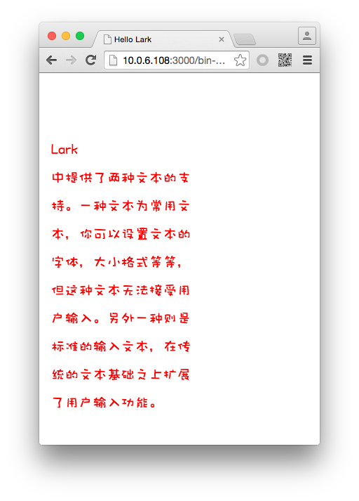

#Lark Core 编程指南 - 文本示例


我们在TextField中输入一段文本，并调整文本的颜色，字体和行间距等属性。代码如下：

```
class TextDemo extends lark.Sprite
{
    public constructor()
    {
        super();

        var txt = this.createText(16.6,95.85, "Lark中提供了两种文本的支持。一种文本为常用文本，你可以设置文本的字体，大小格式等等，但这种文本无法接受用户输入。另外一种则是标准的输入文本，在传统的文本基础之上扩展了用户输入功能。");
        txt.textColor=0xff0000;
        txt.fontSize= 20;
        txt.width = 200;
        txt.lineSpacing = 20;
        txt.fontFamily = "Wawati SC";

    }

    private createText(_x:number,_y:number,_text:string):lark.TextField
    {
        var txt:lark.TextField = new lark.TextField();
        txt.x = _x;
        txt.y = _y;
        txt.text = _text;
        this.addChild(txt);
        return txt;
    }

}
```

在 `Main.ts` 中代码如下：

```
class Main extends lark.Sprite {
    constructor() {
        super();

        var td:TextDemo = new TextDemo();
        this.addChild( td );
    }

}
```

运行后效果如图：

