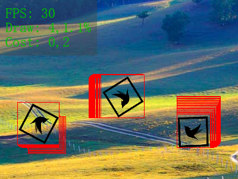
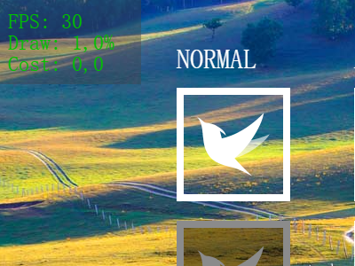

#Lark Core 编程指南 - 调试功能

##显示脏矩形和帧频信息

在 template/index.html 中能够很方便的控制脏矩形和帧频信息的显示状态。

```html
    <div id="lark-sample" class="lark-player"
         ...
         data-show-paint-rect="false"
         data-show-fps="false" 
		 ...
		 >
    </div>
```

### `data-show-paint-rect="true/false"`

设置是否显示重绘区域，当这个值为 `true` 时 Lark 会将舞台中的重绘区域用红框表示出来。


		
### `data-show-fps="true/false"`
	
设置是否显示帧频信息，当这个值为 `true` 时 Lark 会在舞台的左上角显示 FPS 和 其他性能指标
		
		```
		FPS:  60           - 帧频
		Draw: 4,12%        - 每帧 draw 方法调用的平均次数，脏区域占舞台的百分比
		Cost: 1,3          - 每帧舞台所有事件处理和矩阵运算耗时，绘制显示对象耗时（单位是ms） 
		```
		
