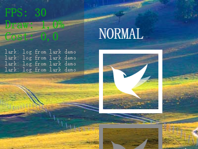

#Lark Core 编程指南 - 调试功能

##使用内置日志输出面板

在桌面端我们能够方便的使用 `console` 提供的诸多方法输出日志，然后使用浏览器提供的开发者工具查看。
但是在移动端这个方式收到了限制，大多数的浏览器没有方便的方法来查看日志。
因此 Lark 集成了向屏幕输出日志的功能，方便移动设备调试。

需要注意的是，内置日志输出面板只在 DEBUG 模式下可用，为了减小代码体积，发行版中会去掉这个功能。



###打开日志显示开关

在 template/index.html 中能够很方便的控制日志的显示状态。

```html
    <div id="lark-sample" class="lark-player"
         ...
         data-show-log="true" 
		 data-log-filter="^lark"
		 ...
		 >
    </div>
```

#### data-show-log="true/false"
        设置是否在屏幕中显示日志。
        
#### data-log-filter="{regular expression}"
        设置一个正则表达式过滤条件，日志文本匹配这个正则表达式的时候才显示这条日志。
        如 `data-log-filter="^lark"` 表示仅显示以 `lark` 开头的日志。
        


###输出日志

在代码中可以直接调用 `lark.log(message?:any, ...optionalParams:any[])` 来输出日志。
在DEBUG模式下，日志会被绘制到屏幕的日志输出面板，在发行版中会直接调用系统的 console 来输出日志。
    