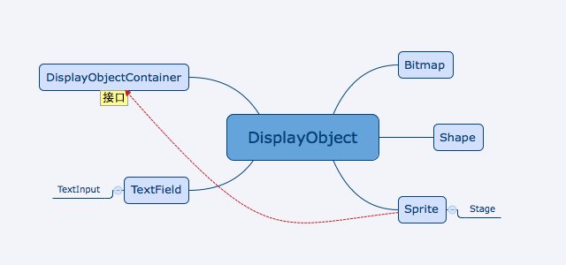

#Lark Core 编程指南 - 核心显示类

Lark中一共封装了7个显示相关的核心类，一个接口，具体继承结构如下：

| 类                     | 描述                                     |
| -----------------------|----------------------------------------- |
| DisplayObject          | 显示对象基类，所有显示对象均继承自此类        |
| Bitmap                 | 位图，用来显示图片                         |
| Shape                  | 用来显示矢量图，可以使用其中的方法绘制矢量图形 |
| DisplayObjectContainer | 显示对象容器接口，所有显示对象容器均实现此接口  |
| Sprite                 | 轻量级显示容器                             |
| Stage                  | 舞台类                                    |
| TextField              | 文本类                                    |
| TextInput              | 输入文本类                                 |

在后面的章节中，我们会一次介绍各个显示对象的概念及使用方法。