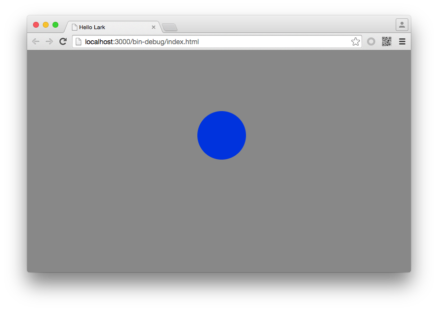

#Lark Core 编程指南 - 显示对象示例


我们来扩展一个自己的显示对象类，该类负责国际象棋游戏中的棋盘绘制。

具体需求有如下几个：

1. 继承自Sprite类，可能棋盘中还会添加其他的显示对象。
2. 可以设置棋盘的行列，棋盘大小并不写死。
3. 可以设置格子的边长，由于国际象棋棋盘为正方形格子，所以只需要边长即可。
4. 可以设置格子的颜色。
5. 手动控制绘图操作。

先创建一个名称为 `Board`的类。

```
class Board extends lark.Sprite
{
    private _row:number = 0;       //行
    private _coloumn:number = 0;   //列
    private _side:number = 0;

    constructor(row:number, coloumn:number, side:number) {
        super();
        this._row = row;
        this._coloumn = coloumn;
        this._side = side;
    }
}
```

由于颜色涉及单数颜色和双数颜色，针对颜色值做封装处理。

```
private _sigularColor:string = "#ffffff";
private _dualColor:string = "#000000";

public get sigularColor():string
{
    return this._sigularColor;
}
public set sigularColor(value:string)
{
    this._sigularColor = value;
}

public get dualColor():string
{
    return this._dualColor;
}
public set dualColor(value:string)
{
    this._dualColor = value;
}
```

在`Board`类中，绘制对象为一个内部的Shape类型实例。

```
private _shp:lark.Shape ;
```

最后关于绘图操作封住四个方法：

1. `onDraw` 方法：公开方法，由上层业务逻辑调用，执行绘图操作。
2. `drawRect` 方法： 私有方法，针对Shape执行绘制矩形操作。
3. `drawSingularRect` 方法： 私有方法，绘制单数颜色。
4. `drawDualRect` 方法： 私有方法，绘制双数颜色。

实现如下：

```
public onDraw()
{
    if( this._shp==null )
    {
        this._shp = new lark.Shape();
        this.addChild( this._shp );
    }
    this._shp.graphics.clear();
    //执行绘图
    for(var i:number=0; i<this._coloumn; i++)
    {
        for(var t:number=0; t<this._row; t++)
        {
            if((i+t)%2==0)
            {
                this.drawSingularRect(this._shp.graphics,t,i);
            }
            else
            {
                this.drawDualRect(this._shp.graphics,t,i);
            }
        }
    }
}

private drawSingularRect(grap:lark.Graphics,_row:number,_col:number)
{
    this.drawRect(grap, this._sigularColor, _row, _col);
}

private drawDualRect(grap:lark.Graphics,_row:number,_col:number)
{
    this.drawRect(grap, this._dualColor, _row, _col);
}

private drawRect(grap:lark.Graphics,color:string,_row:number,_col:number)
{
    grap.beginPath();
    grap.fillStyle=color;
    grap.fillRect(_row*this._side, _col*this._side, this._side, this._side);
}
``` 


`Board` 类完整代码如下：

```
class Board extends lark.Sprite
{
    private _row:number = 0;       //行
    private _coloumn:number = 0;   //列
    private _side:number = 0;

    constructor(row:number, coloumn:number, side:number) {
        super();
        this._row = row;
        this._coloumn = coloumn;
        this._side = side;
    }

    private _shp:lark.Shape ;

    public onDraw()
    {
        if( this._shp==null )
        {
            this._shp = new lark.Shape();
            this.addChild( this._shp );
        }
        this._shp.graphics.clear();
        //执行绘图
        for(var i:number=0; i<this._coloumn; i++)
        {
            for(var t:number=0; t<this._row; t++)
            {
                if((i+t)%2==0)
                {
                    this.drawSingularRect(this._shp.graphics,t,i);
                }
                else
                {
                    this.drawDualRect(this._shp.graphics,t,i);
                }
            }
        }
    }

    private drawSingularRect(grap:lark.Graphics,_row:number,_col:number)
    {
        this.drawRect(grap, this._sigularColor, _row, _col);
    }

    private drawDualRect(grap:lark.Graphics,_row:number,_col:number)
    {
        this.drawRect(grap, this._dualColor, _row, _col);
    }

    private drawRect(grap:lark.Graphics,color:string,_row:number,_col:number)
    {
        grap.beginPath();
        grap.fillStyle=color;
        grap.fillRect(_row*this._side, _col*this._side, this._side, this._side);
    }

    private _sigularColor:string = "#ffffff";
    private _dualColor:string = "#000000";

    public get sigularColor():string
    {
        return this._sigularColor;
    }
    public set sigularColor(value:string)
    {
        this._sigularColor = value;
    }

    public get dualColor():string
    {
        return this._dualColor;
    }
    public set dualColor(value:string)
    {
        this._dualColor = value;
    }

}
```

`Main.ts`文件中代码如下：

```
class Main extends lark.Sprite {
    constructor() {
        super();

        var board:Board = new Board(5,5,50);
        board.x = 100;
        board.y = 100;
        board.onDraw();
        this.addChild( board );

    }   
}
```


最终运行效果：


