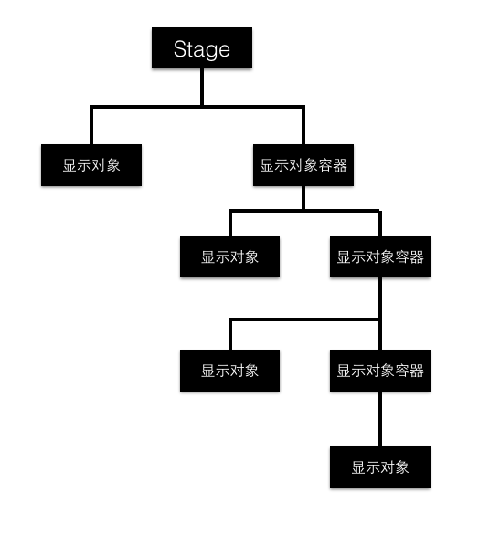

#Lark Core 编程指南 - 遍历显示列表


如您所见，显示列表是一个树结构。树的顶部是舞台，它可以包含多个显示对象。那些本身就是显示对象容器的显示对象可以包含其他显示对象或显示对象容器。



由于显示对象容器可以包含其他显示对象容器作为其显示列表中的子对象，因此您可将应用程序的完整显示列表作为树来遍历。

下面的函数提供了显示对象容器中显示列表的缩进式 console.log() 输出：

```
private printDisplayList(container:lark.DisplayObjectContainer, indentString:String = ""):void
{
    var child:lark.DisplayObject;
    for (var i:number=0; i < container.numChildren; i++)
    {
        child = container.getChildAt(i);
        lark.log(indentString, child, child.name);
    }
}
```

运行后会打印出当前场景中得显示对象以及显示对象容器。
