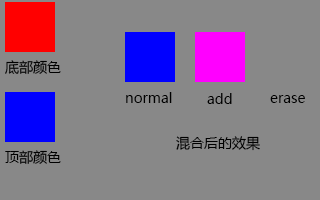

#Lark Core 编程指南 - 应用混合模式
混合模式涉及将一个图像（基图像）的颜色与另一个图像（混合图像）的颜色进行组合来生成第三个图像，所得的图像是实际在屏幕上显示的图像。图像中的每个像素值都会被使用其它图像的对应像素值进行处理，以便在结果的同一位置生成一个像素值。

每个显示对象都有 blendMode 属性，可以将其设置为下列混合模式之一。以下是在 BlendMode 类中定义的常量。此外，还可以使用 String 值，这些值是常量的实际值。
```  TypeScript
//用于指定混合图像的像素值覆盖基本图像的像素值
mySprite.blendMode = lark.BlendMode.NORMAL;
mySprite.blendMode = "normal";
```
```  TypeScript
//通常用于创建两个图像之间的动画变亮模糊效果。
mySprite.blendMode = lark.BlendMode.ADD;
mySprite.blendMode = "add";
```
```  TypeScript
//根据显示对象的 Alpha 值擦除背景。Alpha 值不为0的区域将被擦除。
mySprite.blendMode = lark.BlendMode.ERASE;
mySprite.blendMode = "erase";
```



最终效果如图所示
