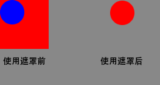

#Lark Core 编程指南 - 遮罩显示对象
可以通过将一个显示对象用作遮罩来创建一个孔洞，透过该孔洞使另一个显示对象的内容可见。
##定义遮罩
若要指明一个显示对象将是另一个显示对象的遮罩，请将遮罩对象设置为被遮罩的显示对象的 mask 属性：
```  TypeScript
//将maskSprite设置为mySprite的遮罩
mySprite.mask = maskSprite;
```
被遮罩的显示对象显示在用作遮罩的显示对象的全部不透明区域之内。例如，下面的代码将创建一个包含 100 x 100 个像素的红色正方形的 Shape 实例和一个包含半径为 25 个像素的蓝色圆的 Sprite 实例。单击圆时，它被设置为正方形的遮罩，所以显示的正方形部分只是由圆完整部分覆盖的那一部分。换句话说，只有红色圆可见。
```  TypeScript
//画一个红色的正方形
var square:lark.Shape = new lark.Shape();
square.graphics.fillStyle = "rgb(255,0,0)";
square.graphics.fillRect(0,0,100,100);
this.addChild(square);

//画一个蓝色的圆形
var circle:lark.Shape = new lark.Shape();
circle.graphics.fillStyle = "rgb(0,0,255)";
circle.graphics.beginPath();
circle.graphics.arc(25,25,25,0,Math.PI*2,false);
circle.graphics.fill();
circle.graphics.closePath();
this.addChild(circle);

//圆形增加点击的监听
circle.on(lark.TouchEvent.TOUCH_TAP,onClick,this);

function onClick():void{
  //给正方形设置一个圆形的遮罩,最终的显示效果是一个红色的圆形
  square.mask = circle;

}
```
最终效果如图所示



用作遮罩的显示对象可设置动画、动态调整大小。遮罩显示对象不一定需要添加到显示列表中。但是，如果希望在缩放舞台时也缩放遮罩对象，或者如果希望支持用户与遮罩对象的交互（如调整大小），则必须将遮罩对象添加到显示列表中。

通过将 mask 属性设置为 null 可以删除遮罩：
```  TypeScript
mySprite.mask = null;
```
不能使用一个遮罩对象来遮罩另一个遮罩对象。
