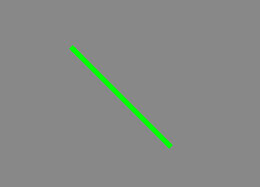
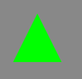
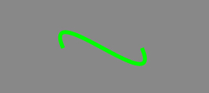

#Lark Core 编程指南 - 绘制直线和曲线

使用 Graphics 实例进行的所有绘制均基于包含线条和曲线的基本绘制。因此，必须使用一系列相同的步骤来执行所有 
Lark 绘制：
 -  定义线条和填充样式
 -  设置初始绘制位置
 -  绘制线条、曲线和形状 （可选择移动绘制点）
 -  如有必要，完成创建填充
 
#### 定义线条和填充样式
要使用 Shape 实例的 graphics 属性进行绘制，您必须先定义在绘制时使用的样式 （线条大小和颜色、填充颜色）。就像使用 Adobe Flash Professional 或其他绘图应用程序中的绘制工具一样，使用 Lark 进行绘制时，可以使用笔触进行绘制，也可以不使用笔触；可以使用填充颜色进行绘制，也可以不使用填充颜色。您可以使用 lineStyle() 或 lineGradientStyle() 方法来指定笔触的外观。   

在本节的示例代码，均假设有一个现成的Graphics实例graphics：
```
var shape = new lark.Shape();
this.addChild( shape );
var graphics = shape.graphics;
```
要创建纯色线条，请设置 strokeStyle 属性：

调用此方法时，您指定的最常用的值是前三个参数：线条粗细、颜色。例如，该行代码指示graphics 对象绘制 2 个像素粗、红色(#990000) ：
``` TypeScript
graphics.lineWidth = 5;
graphics.strokeStyle="#00ff00";
```

#### 绘制直线
调用 stroke() 方法时，Graphics 对象将绘制一条直线，该直线从当前绘制点到指定为方法调用中的两个参数的坐标，以便使用指定的线条样式进行绘制。
任何绘制都要从调用 beginPath() 方法开始。
绘制线条结束时，调用 stroke() 结束绘制。
例如，该行代码将绘制点放在点 (100, 100) 上，然后绘制一条到点 (200, 200) 的直线：   
``` TypeScript
graphics.beginPath();
graphics.moveTo( 100, 100);
graphics.lineTo( 200, 200 );
graphics.stroke();
```
效果如图：  


当进行一系列的绘制，线条终点与起点闭合时，可对包含区域进行填充。填充前通过 fillStyle 来设置填充颜色。然后简单的调用 fill() 进行填充。
以下示例绘制红色三角形，其高度为 100 个像素：
``` TypeScript
var hTriangle:number = 100; 

// red triangle, starting at point 0, 0 
graphics.beginPath();
graphics.moveTo( hTriangle / 2, 0 ); 
graphics.lineTo( hTriangle, hTriangle ); 
graphics.lineTo( 0, hTriangle ); 
graphics.lineTo( hTriangle / 2, 0 ); 
graphics.fillStyle = "#FF0000" ;
graphics.fill();
```
效果如图：  


#### 绘制曲线
bezierCurveTo() 方法可以绘制二次贝塞尔曲线。这将绘制一个连接两个点（称为锚点）的弧，同时向第三个点 （称为控制点）弯曲。 Graphics 对象使用当前绘制位置作为第一个锚点。调用 bezierCurveTo() 方法时，将传递以下六个参数：控制点1的 x 和 y 坐标，控制点2的 x 和 y 坐标，最后两个参数是第二个锚点的 x 和 y 坐标。
例如，以下代码绘制一条曲线，它从点 (200, 200) 开始，到点 (300, 200) 结束。由于控制点位于起点左上角和终点的右下角，因此，这会创建一条曲线，它先向左上移动，然后向右下移动，形成一个两头带钩的形状：

``` TypeScript
graphics.beginPath();
graphics.moveTo( 200, 200 );
graphics.bezierCurveTo( 175, 125, 280, 200 , 300, 200 );
graphics.stroke();
```
效果如图：  



 