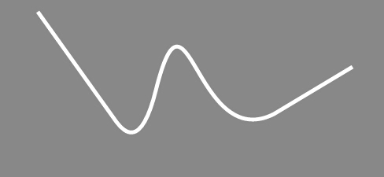
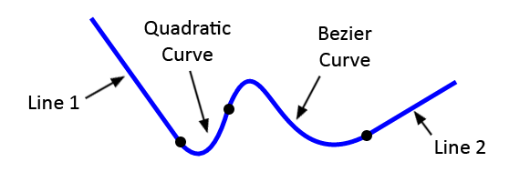

#Lark Core 编程指南 - 绘制路径

事实上，在前边两节(绘制直线和曲线/绘制形状)已经是绘制路径了。   
正如这两节的代码示例，绘制路径前通常都会调用 beginPath() 方法，以清除之前绘制的路径。若之前还没画过任何路径，也可以不调用此方法。   

不过，绘制路径不但支持简单的两点间绘制，还可以对若干的线条进行连续绘制。    
这里，我们绘制一条包含直线、二次曲线和贝塞尔曲线的连续线条，如下：   

   

绘制代码：
``` TypeScript
var shape = new lark.Shape();
this.addChild( shape );
var graphics = shape.graphics;

graphics.beginPath();
graphics.moveTo(100, 20);

// line 1
graphics.lineTo(200, 160);

// quadratic curve
graphics.quadraticCurveTo(230, 200, 250, 120);

// bezier curve
graphics.bezierCurveTo(290, -40, 300, 200, 400, 150);

// line 2
graphics.lineTo(500, 90);

graphics.lineWidth = 5;
graphics.strokeStyle = 'blue';
graphics.stroke();
```

代码中每段线条的位置，如下图所示：  
   
