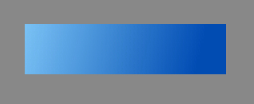
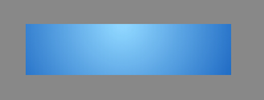

#Lark Core 编程指南 - 创建渐变和填充

#### 线性渐变
要用 Graphics 创建一个线性渐变，我们可以使用 createLinearGradient() 方法。线性梯度是由一个假想线定义的方向梯度。一旦我们创建渐变,我们可以使用 addColorStop 插入颜色属性。   

线性梯度的方向移动从起点到终点的假想线定义 createLinearGradient() 。在本教程中,我们使用两个色,浅蓝色,起源于在梯度的起点,和一个结尾的深蓝色的终点。颜色停止被放置在假想线介于0和1,0是起点,1是在终点。   

以下代码创建一个蓝色由浅入深的渐变：   
``` TypeScript

var shape = new lark.Shape();
this.addChild( shape );
var graphics = shape.graphics;

graphics.beginPath();

/// 设定显示区域
graphics.rect( 50, 50, 400, 100 );

var grd:lark.GraphicsGradient = lark.Graphics.createLinearGradient( 0, 0, 400, 100 );
grd.addColorStop( 0, "#8ED6FF" );
grd.addColorStop( 1, "#004CB3" );

graphics.fillStyle = grd;
graphics.fill();

```
createLinearGradient() 方法设定渐变区域，该区域与显示区域没有严格的对应关系要求，完全根据实际需要来设定。   

运行效果如图：   
   
大家可以自己调整参数数值，观察生成结果变化。

#### 径向渐变
当然也可以创建径向渐变填充，将上述代码的创建渐变代码一行修改为：
``` TypeScript
var grd:lark.GraphicsGradient = lark.Graphics.createRadialGradient( 238, 50, 10, 238, 50, 300 );
```
createRadialGradient() 方法设定的渐变区域是一个环形，由两个同心圆组成。参数一个六个，分为两组，每组对应一个圆，每组的三个参数分别是所对应圆形的x、y坐标和圆半径。

运行效果如图：   
   
同样可以调整参数，观察生成结果变化。
