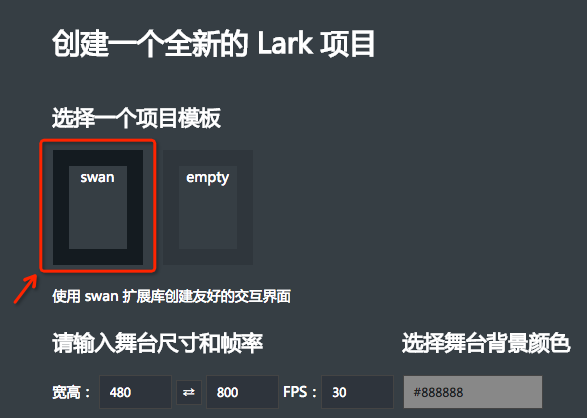
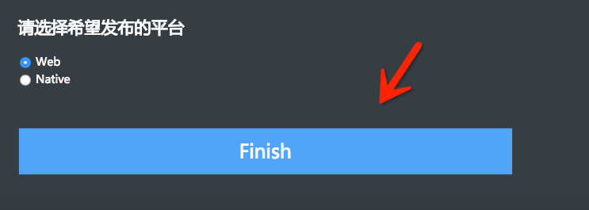

#Swan (UI库) 编程指南 - 快速入门

###使用示例项目

最简单的开始学习Swan扩展库的方式，就是运行我们的示例项目，在examples目录下有一个[UIExamples](https://github.com/egret-labs/Lark/tree/master/examples/UIExamples)项目，您可以在命令行进入相应的目录，执行 lark run 来查看该项目的运行效果。或者直接在这个项目基础上开始修改学习。

另外，您还可以访问我们的[在线API文档](http://edn.egret.com/cn/index.php/apidoc/lark/name/swan.Button)，查看Swan扩展库每个类页面下方的示例，这些示例覆盖到了每个类的常见用法。

###创建一个新的Swan项目

我们在Lark命令行中，为您准备好了包含Swan扩展库的项目模板，您只需要按照以下步骤，创建一个标准的Swan项目，在模板项目基础上开始编写自己的代码即可。

首先打开命令行，进入您的工作目录，执行 `lark create HelloSwan`, Lark 会创建一个 HelloSwan 目录作为项目的根目录 ( 如果您想要在当前目录创建项目，可以直接执行 `lark create` )。命令行工具会自动打开一个浏览器窗口，如下图：

请在 **选择一个项目模板** 这部分确保选择中了 **swan** 模板。页面中间还有一些可选设置，您可以修改或者直接使用默认的设置。最后点击下图中的 **Finish** 按钮完成创建即可。

最后我们在命令行进入刚刚创建的`HeeloSwan`项目的根目录，执行 `lark run` 就能在弹出的浏览器看到一个显示在浏览器正中的按钮：

点击它会弹出一个对话框。接下来您只需删除模板项目 `Main.ts` 里创建按钮的那部分代码，即可开始编写一个全新的项目。模板项目中已经自带了一套默认的皮肤主题。
