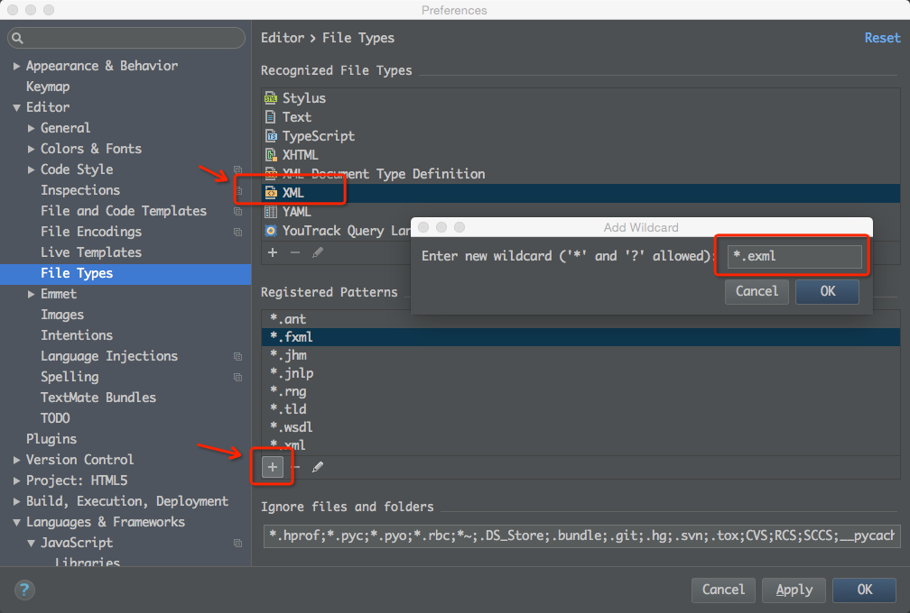
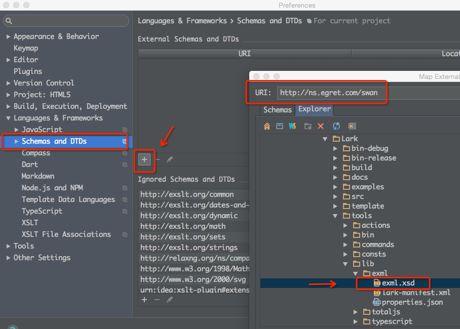
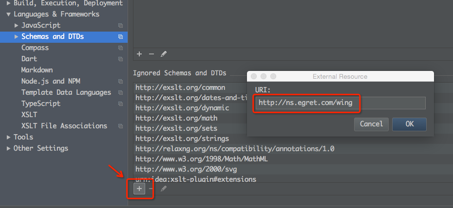

#Swan (UI库) 编程指南 - 启用EXML语法提示

EXML在Egret Wing里已经默认支持语法提示。我们还提供了标准的xsd文件供其他IDE开启EXML的语法提示。下面以流行的WebStorm为例，介绍一下如何在WebStorm 10中开启EXML的语法提示。

###设置EXML的打开方式为XML编辑器

在WebStorm里面点击菜单上的File→Settings，打开Settings面板。在左边的选项上选择File Types标签页。在右上方Recognized File Types上找到XML files并选中。最后点击右边中下方的"＋"图标，弹出窗口Add Wildcard中输入"*.exml" 点击 OK ， 然后应用更改。如下图：

###获取XSD文件

您可以在Lark的源码工程目录中找到EXML的XSD文件，它的存放路径：{Lark根目录}/tools/lib/exml/exml.xsd。您也可以直接从Github上下载最新版本的XSD文件：https://github.com/egret-labs/Lark/blob/master/tools/lib/exml/exml.xsd

###设置XSD架构文件
依旧在WebStorm里面点击菜单上的File→Settings，打开Settings面板。在左边的选项上选择Schemas and DTDs标签页。在右上方External Schemasc and DTDs上点击"+"图标。弹出Map External Resource窗口。 在URI输入框中输入"http://ns.egret.com/swan" , 并在下面文件选择中选择exml.xsd文件所在的位置（如果没有，可以切换到Explorer选项卡手动选择之前存放xsd的路径，我们这里直接选取 {Lark根目录}/tools/lib/exml/exml.xsd），最后点击OK，如下图：

最后在External Schemasc and DTDs的右下方Ignored Schemas and DTD选项卡上点击"+"图标，弹出External Resource窗口加入忽略的命名空间w的URI，输入"http://ns.egret.com/wing" 。点击ok。 如下图：

最后点击OK ， 就可以享受EXML自动补全和提示的功能了。

