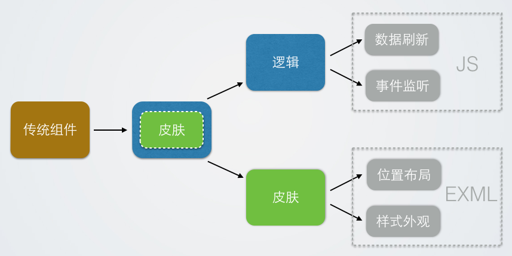

#Swan (UI库) 编程指南 - 皮肤分离机制

###什么是皮肤分离

以制作一个UI窗口为例，传统制作方式大体类似这样：实例化一个容器，在容器初始化时添加各种素材，分别设置样式布局，然后增加事件监听处理逻辑。动态的逻辑和静态的布局以及样式都耦合在一个类里。皮肤分离就是把样式从逻辑中解耦出来，用一个逻辑组件外加一个皮肤对象的方式去实现原来单个组件的功能。逻辑组件里只负责动态的逻辑控制代码，如事件监听和数据刷新。皮肤里只负责外观，如实例化子项，初始化样式和布局等静态的属性。如下图：

可能会有人比较担心皮肤分离后的性能，一个组件拆分了成了两个，不会增加嵌套层级吗？答案是不会，因为这里的皮肤并不是显示对象。您可以把它理解为一个数据对象，存储了初始化显示列表和外观需要的特定数据。将皮肤附加到逻辑组件上的过程就是对逻辑组件应用一些列外观创建的初始化操作。

###分离出皮肤的优势

这样做最浅显的好处是你解耦了逻辑和皮肤，写逻辑的时候，只关注逻辑功能。写皮肤的时候，只关注样式。关注点小了，自然提高了开发效率。但皮肤分离的意义绝对不仅在这个层面上。

如果你的项目从头到尾都是按照皮肤分离的规范写的，当需要换肤时，逻辑代码几乎不用修改一行，重新给逻辑组件的skinName属性赋值一个新的皮肤，即可完成外观替换。这样做的另一个好处是可以共享皮肤。比如同一个外观的按钮，你只要写一个皮肤，所有按钮的skinName都可以引用它。不需要重复设置外观。引用同一个皮肤的组件，一次修改全部更新。但这还不是皮肤分离的真正好处。

先观察下分离出来的都是些什么东西？是布局和样式。而布局和样式又是另外一个东西：项目里修改最频繁的部分。让我们回忆一下传统开发模式里最痛苦的部分：每次到一堆代码里找到并修改一个颜色或坐标，然后运行一次看看效果对不对，不对再来一遍，如此反复下去…皮肤分离真正的好处是可以让程序员不用再写皮肤，关注更加纯粹的逻辑代码。由于分离出来的布局和样式，都是比较容易静态化的东西。所以我们可以用XML来描述它，用可视化编辑器来生成它。从而极大降低外观的修改成本。

大家可能会注意到一个问题，皮肤分离机制对制作可复用的外观比较有优势。那对于只使用一次的皮肤呢？如果也拆分出两个文件，显然不太方便。这里我们针对单次使用的皮肤定制了内部类的功能，可以参考[EXML基本语法(二)](3-2-exml-syntax-2.md)中的「内部类」一节，了解具体的使用方式。