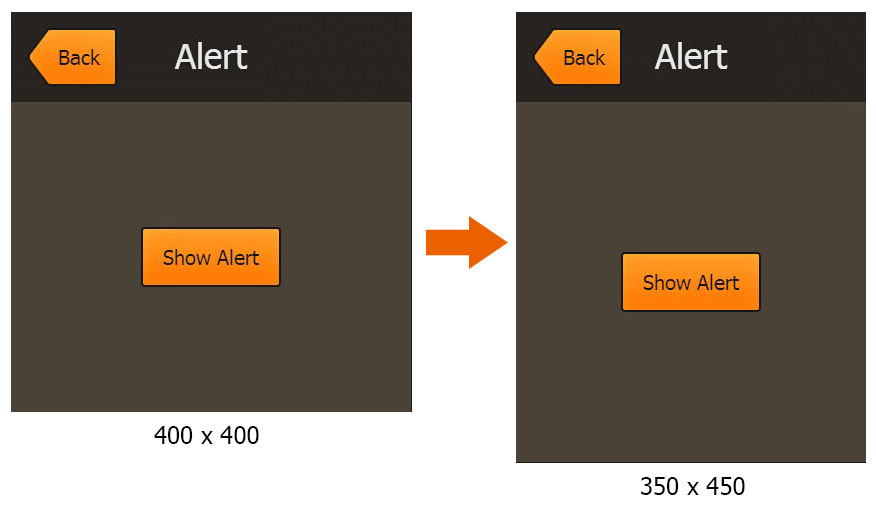

#Swan (UI库) 编程指南 - 屏幕适配
移动设备上存在各种分辨率的屏幕，如何能够使用一套代码写出适应各种分辨率屏幕的UI界面，显得尤为重要。这里要特别注意一个概念：完善的屏幕适配其实分为两个步骤：1.舞台尺寸(Stage.stageWidth,Stage.stageHeight)与设备屏幕的适配关系。2.内部UI界面与舞台尺寸的适配关系。通常大家说说的屏幕适配都只做到了第一步骤，也就是通过设置舞台的scaleMode属性来解决舞台尺寸，但是没有做第二个步骤，还是无法达到预期效果，因为界面是写死的，它可能自己就自动帮你调整尺寸了。

而在Swan库里，我们通过引入自适应流式布局（简称自动布局），能够完美地解决第二步骤的屏幕适配问题。下面先来看一个屏幕适配的实际例子：

```
class Main extends lark.Sprite{

    public constructor(){
        super();
        this.addEventListener(lark.Event.ADDED_TO_STAGE,this.onAddToStage,this);
    }

    public onAddToStage(event:lark.Event):void{
        var uiLayer:swan.UILayer = new swan.UILayer();
        this.addChild(uiLayer);

        var exmlText = `<s:Group width="100%" height="100%" xmlns:s="http://ns.egret.com/swan">
                            <s:Image source="image/header-background.png" fillMode="repeat" width="100%" height="90"/> 
                            <s:Label horizontalCenter="0" top="25" text="Alert"/>
                            <s:Button skinName="skins.BackButtonSkin" top="16" left="16" label="Back"/>
                            <s:Group width="100%" top="90" bottom="0">
                                <s:Button skinName="skins.ButtonSkin" horizontalCenter="0" verticalCenter="0" label="Show Alert"/>
                            </s:Group>
                        </s:Group>`;

        var exmlClass = EXML.parse(exmlText);
        var group:swan.Group = new exmlClass();
        uiLayer.addChild(group);
    }
}
```

Main是程序的入口类，我们在Main被添加到舞台时，开始创建一系列的子项:首先要创建一个UILayer，它是UI的根容器，它的宽高会自动跟舞台宽高保持一致，起到最外层的自适应作用。然后我们使用EXML快速实例化一些列的组件，简便起见，这里直接将EXML的内容嵌入到代码中，（请参考[如何使用EXML](3-1-use-exml.md)的 `嵌入EXML到代码` 一节）。下面简单介绍EXML里实例化的内容：

(1)标题栏背景:显式设置高度为90像素，宽度设置为父级容器的100%(percentWidth = 100)，也就是始终跟uiStage一样宽。

(2)标题文本:垂直方向距离顶部25像素(top = 25，这里等同于直接设置y=25)。水平方向居中(horizontalCenter = 0)。

(3)返回按钮:垂直方向距离顶部16像素，水平方向距离左边16像素。同理，这里也可以直接设置x = y = 16。这里请先忽略skinName属性的细节，我们直接引用了一个类名是 `skins.BackButtonSkin` 的按钮皮肤。

(4)内容容器:水平方向宽度跟父级容器保持一致(percentWidth = 10),注意下垂直方向，距离顶部90像素且距离底部0像素(top = 90,bottom = 0)，也就是说它的高度会被拉伸，以填满父级y=90至最底部的区域。最终效果就是contentGroup始终覆盖除了标题栏的区域。

(5)”Show Alert”按钮:注意这个按钮被添加到了内容容器里，他的水平位置和垂直位置都相对contentGroup居中。

这样定义布局规则后，无论舞台尺寸变成什么比例，最终的显示效果都会自动适应。而不需要改动一行代码。这能有效解决移动开发中的各种屏幕分辨率适配问题。运行结果大致如下图：



自动布局不仅能解决屏幕分辨率适配问题，同样也是皮肤复用的基石。使用自动布局的皮肤，能够自动适应各种逻辑组件尺寸，自动调整内部皮肤部件的位置，从而最大程度上复用皮肤。

关于流式结构，我们以上面的代码为例：”Show Alert”按钮在contentGroup中，contentGroup在根Group中，根Group在UILayer中。当舞台尺寸发生改变时，最外层的UILayer就会调整自己的宽度跟舞台保持一致，然后由于根Group设置了宽高100%，也会主动跟UILayer保持一致。再往内就会去调整contentGroup的尺寸，从而contentGroup再刷新布局调整”Show Alert”按钮的位置，始终保持居中。整个是UI的显示列表就是这样一个结构，一处发生改变，与其相关联组件的位置尺寸都会自动刷新。并且这个自动刷新过程无需担心频繁的计算消耗，因为自动布局使用了`失效验证`的机制来提供强力的性能保障。下一节内容中我们将会详细讲解这部分内容。