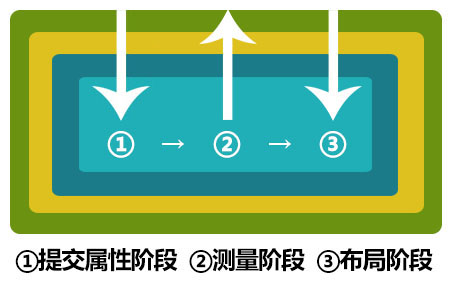

#Swan (UI库) 编程指南 - 失效验证机制

这节内容对于学习使用Swan里的组件并不是必须的，但是了解失效验证机制与自动布局的关系，有助于理解自动布局的过程，从而在遇到布局问题时能够加快调试速度。

###什么是失效验证

失效验证是一种延迟应用改变的优化措施。举个例子：我们现在有一个UI组件，需要在width或height发生改变后，根据当前尺寸用Graphics去重绘一个矩形背景。在立即应用的情况下，当我们分别修改它的width和height时，组件会分别执行2次Graphics绘制。如果我们在一个for循环里不断改变尺寸，改变多少次就立即绘制多少次。而在失效验证的情况下，当尺寸发生改变时，它只是用一个变量标记下尺寸发生了改变，然后延迟一帧检查这个变量再统一执行一次Graphics绘制。所以无论你同一时间改变了尺寸多少次，结果都只绘制了一次。

以下代码就是失效验证机制的最简单实现:

```
class UIComponent extends lark.Shape{

    public constructor(){
        super();
    }

    private sizeChanged:boolean = false;

    private _width:number;

    public get width():number{
        return this._width;
    }
    public set width(value:number){
        if(this._width==value)
            return;
        this._width = value;
        this.sizeChanged = true;
        this.invalidateProperties();
    }

    private _height:number;

    public get height():number{
        return this._height;
    }
    public set height(value:number){
        if(this._height==value)
            return;
        this._height = value;
        this.sizeChanged = true;
        this.invalidateProperties();
    }

    public commitProperties():void{
        if(this.sizeChanged){
            this.sizeChanged = false;
            this.redrawBackground();
        }
    }

    private redrawBackground():void{
        var g:lark.Graphics = this.graphics;
        g.clear();
        g.fillStyle = 0x009aff;
        g.fillRect(0, 0, this._width, this._height);
    }


    private invalidatePropertiesFlag:boolean = false;

    public invalidateProperties():void{
        if(this.invalidatePropertiesFlag)
            return;
        this.invalidatePropertiesFlag = true;
        this.on(lark.Event.ENTER_FRAME,this.validateProperties,this);
    }

    private validateProperties(event:lark.Event):void{
        this.removeListener(lark.Event.ENTER_FRAME,this.validateProperties,this);
        this.commitProperties();
        this.invalidatePropertiesFlag = false;
    }
}
```

redrawBackground()就是根据当前宽高绘制背景的方法。当UIComponent的width或height在外部被赋值修改后，不直接调用redrawBackground()重绘背景,而是先用sizeChanged属性标记尺寸发生了改变，然后调用invalidateProperties()方法，标记有属性失效，需要延迟验证。invalidateProperties()方法里通过监听ENTER_FRAME事件，来实现在下一帧再执行commitProperties()方法。commitProperties()方法里就是判断sizeChanged属性，然后最终执行redrawBackground()；在这之前，无论你对width或height执行了多少次修改，最终redrawBackground()只会执行一次。在实际使用中，这些异步过程都封装好了，我们只需要关注那一对方法： `invalidateProperties()` 和 `commitProperties()` ，前者标记属性失效，后者应用失效的属性。

###针对布局的失效验证

上文我们介绍了一种通用的属性失效验证方法，作用是能够有效避免不必要的重复计算，从而显著提升运行时计算性能。那么我们是如何把这个优化机制应用到自动布局中去的呢？

Swan中除了通用的属性失效验证，还封装了针对布局的两种失效验证：一个是测量验证，一个是布局验证。写法与 `invalidateProperties()` 和 `commitProperties()` 如出一辙，这里就不贴代码了。同理,我们也只需关心那一对方法，测量：`invalidateSize()` 和 `measure()`，前者标记尺寸失效，后者测量尺寸，布局：`invalidateDisplayList()` 和 `updateDisplayList()`，前者标记布局失效，后者更新布局。Swan内维护了三个失效列表，然后会按照:提交属性->测量尺寸->更新布局，这种顺序依次进行验证。另外，单个失效列表内也是有序的，按照UIComponent在显示列表内的嵌套层级排序。提交属性阶段是由外至内，测量阶段是由内至外，更新布局阶段又是由外至内。如下图：





这种排序方式主要是为了减少重复的计算。例如测量阶段，父级的测量结果是由子项决定的，显然由内至外的测量顺序才能保证测量结果的正确性。若是无序的，子项测量的尺寸发生改变后，会通知父级再次测量。就会造成大量重复的计算。这里面其实只有测量和布局阶段与嵌套层级执行顺序有关，提交属性阶段只是组件内部的失效验证，无所谓由内至外或由外至内。
