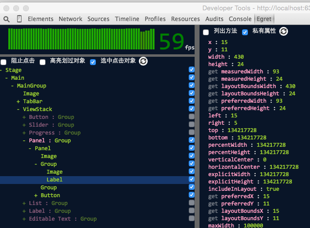

#Swan (UI库) 编程指南 - 自动布局调试

###组件上与调试相关的布局属性

(1)includeInLayout：指定此组件是否包含在父容器的布局中。若为false，则父级容器在测量和布局阶段都忽略此组件。默认值为true。visible属性与此属性不同，设置visible为false，父级容器仍会对其布局。如果你想”完全”隐藏掉一个组件，同时设置它的visible和includeInLayout为false即可。另外，这个属性对于缓动动画也非常有用，如果要对一个含有自动布局的UI组件执行缓动动画，在动画开始时设置此属性为false即可，它会确保UI组件从当前的布局结果位置开始缓动，并且不再受自动布局影响。

(2)explicitWidth，explicitHeight：显式设置的宽高值。默认情况下这两个值是NaN。当你显式调用width或height的setter方法赋值时，就会同时对这两个值赋值。width/height的值不一定会一直是你设置的值。如果你设置了布局属性（top+bottom等），就会导致width/height被父级设置成其他值（父级布局尺寸的优先级高于显式设置尺寸）。所以这两个属性的作用就是保存你显式设置的值。调试的时候也可以根据这个判断，是否是被显式设置了尺寸，还是父级强制布局的。

(3)maxWidth,minWidth,maxHeight,minHeight：最大和最小尺寸。这里要注意：它们同时影响测量和布局的结果。measure()方法执行完会对measuredWidth，measuredHeight赋值一次。然后交给UIComponent里的validteSize()方法，再次规范测量结果。这时候就根据这四个值来规范的。最终确定measuredWidth，measuredHeight的值。布局时同理。

(4)width,height：这两个属性储存组件经过各种布局计算后得到的最终的尺寸值。width和height的取值规则：如果没有显式设置它们，就会根据测量的值赋值到它们上，显式设置了，就以显式设置的值为准，但是如果同时设置top+bottom或percentHeight这种布局属性的值，就会以布局属性为准。总结下优先级顺序是：布局设置的值 > 显式设置的值 > 测量的值。

**注意：以下的几个属性仅为了方便调试使用，均只存在于调试版代码中，可以通过调试工具在运行时查看，在发行版中，将无法访问它们。**

(5)measuredWidth，measuredHeight：每个组件measure()方法执行的最终结果就是对这两个属性赋值。它们只记录测量结果。 

(6)preferredWidth，preferredHeight：首选宽高，这两个值通常在measure()方法中被调用。只是个便捷属性，按照explicitWidth，explicitHeight > measuredWidth，measuredHeight的优先级返回值。布局类在measure()方法中，调用子项的这个属性，来获取子项的测量结果。累加到自身的测量结果上。注意这个值已经包含旋转和缩放的值，且返回值永远为正数。

(7)layoutBoundsWidth,layoutBoundsHeight：布局宽高，这两个值通常在updateDisplayList()方法中被调用。也是个便捷属性。按照 布局设置的宽高 > explicitWidth，explicitHeight > measuredWidth，measuredHeight的优先级返回值。注意这个值已经包含旋转和缩放的值，且返回值永远为正数。

(8)preferredX,preferredY,layoutBoundsX,layoutBoundsY：这四个属性，通常情况下就是xy的值。但是当组件含有旋转缩放时。他们为组件旋转缩放后在父级容器里实际显示的起点。

###使用调试工具

Egret Inspector 是一款Chrome开发者工插件，能够帮助开发者快速查看显式列表每个对象的属性，显式，隐藏显示对象，或修改对象属性。使用这个工具能够极大程度方便自动布局的调试。具体安装和使用教程可以参考这里：[Egret Inspector使用手册](http://bbs.egret.com/forum.php?mod=viewthread&tid=2184)

 

###调试技巧

在没有自动布局的体系里，一个组件的尺寸表现错了。直接在这个组件上找问题即可。但当我们引入自动布局后，由于组件在显示列表上的布局是互相影响的。所以一个组件的尺寸或位置不对。问题不一定是在这个组件上，而是有可能在他的父级或子项上。所以我们调试的第一步，一定是先定位到出问题的那个组件。再调试那个组件找出显示不正确的原因。定位的方法可以参考以下步骤进行：

(1)自身是否被显式设置了尺寸？查看explicitWidth，explicitHeight。如果显式设置了，设置的对吗？不对找到问题。没有显式设置就继续。

(2)测量的尺寸对不对？查看measuredWidth，measuredHeight。不对，继续。对，跳到(5)

(3)查看top,left,right,bottom,horizontalCenter,verticalCenter,percentWidth,percentHeight这些布局属性对不对。注意：只有BasicLayout下这些属性才全部有效。

(4)布局类对吗？查看layout属性。以上都查过了，找不出问题，继续按(5)和(6)在显示列表向上或向下开始找。

(5)向上查看父级以及父级的父级容器的相关属性，是否正确。是否是父级容器强制设置了我们的尺寸。

(6)查看子项以及子项的子项的测量尺寸。找到第一个开始不对的节点。

注意：因为Skin是非显示对象，所以它不在显示列表上，但是Skin上的宽高设置也会影响测量。所以检查显示列表时，不要忽略Skin这一层。可以从组件的skin属性上访问它。

