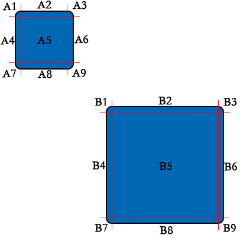

#Swan (UI库) 编程指南 - 图片

图片控件对应的类是 swan.Image。swan.Image 继承自 lark.Bitmap，实现了 swan.UIComponent 接口。因此它不仅拥有基本的位图功能(lark.Bitmap)，还有自动布局功能(swan.UIComponent)。

基本的位图API使用参考 [Lark Core 编程指南 - 处理位图的基本知识](../core/12-0-bitmap.md)

使用 lark.Image 加载并显示一张图片非常简单，代码如下：

```  TypeScript
var image = new  swan.Image();
image.source = "image/icon.png";
this.addChild(image);
```

##显示一个九宫格的图片

如下图所示：



左上角是尺寸为 100x100 的原图，原图显示的是一个圆角区域为10的圆角矩形，右下角是尺寸为 200x200 的结果图片，结果图片显示的同样是一个圆角区域为10的圆角矩形。

把两张图片都分为9个部分，原图划分的区域是 A1-A9，结果图片划分的区域是 B1-B9。其中 B1、B3、B7、B9 是 A1、A3、A7、A9 的直接拷贝，B2、B8 是 A2、A8 经过X方向的放大变换而来，B4、B6 是 A4、A6 经过Y方向的放大变换而来，B5 是 A5 经过X、Y方向的放大变换而来。如果 A2、A8 区域X方向放大不变形， A4、A6 区域Y方向放大不变形，A5 X、Y方向放大不变，则原图无论怎么放大都不变形。

需要注意的是缩小可能会出现问题。

Image 的 scale9Grid 属性是一个指定的矩形区域，矩形区域对应 A5 区域的起点坐标以及宽高。

显示一个指定尺寸为 200x200 的九宫格图片，代码如下：

```  TypeScript
var image = new swan.Image();
image.source = "image/uibg.png";
image.scale9Grid = new lark.Rectangle(10,10,80,80);
image.width = 200;
image.height = 200;
this.addChild(image);
```
