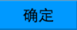

#Swan (UI库) 编程指南 - 按钮

按钮控件对应的类是 swan.Button。swan.Button 集成自 swan.Component类，它具有按钮的基本功能和控件容器的功能(swan.Component)。

要显示一个按钮通常要给按钮指定一个皮肤，按钮的代码如下：

```  TypeScript
var button = new swan.Button();
button.width = 100;
button.height = 40;
button.label = "确定";
button.skinName = "ButtonSkin.exml";
this.addChild(button);
```

皮肤的代码 ButtonSkin.exml 如下：

``` XML
<s:Skin states="up,over,down,disabled" xmlns:s="http://ns.egret.com/swan" xmlns:w="http://ns.egret.com/wing">
    <s:Image source="image/button_up.png" includeIn="up" width="100%" height="100%" scale9Grid="5,5,63,16"/>
    <s:Image source="image/button_over.png" includeIn="over" width="100%" height="100%" scale9Grid="5,5,63,16"/>
    <s:Image source="image/button_down.png" includeIn="down" width="100%" height="100%" scale9Grid="5,5,63,16"/>
    <s:Image source="image/button_disabled.png" includeIn="disabled" width="100%" height="100%" scale9Grid="5,5,63,16"/>
    <s:Label id="labelDisplay" horizontalCenter="0" verticalCenter="0" fontSize="20"/>
</s:Skin>
```

运行后效果如图：




