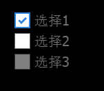

#Swan (UI库) 编程指南 - 复选框

复选框组件 swan.CheckBox 继承自切换按钮 swan.ToggleButton。当它被选中,selected属性将变为true，反之则为false。

当然复选框按钮也继承自按钮 swan.Button 和容器 swan.Component ,他具有按钮和容器的基本功能。

``` TypeScript
var cbx = new swan.CheckBox();
cbx.label = "选择1";
this.addChild(cbx);
cbx.on(swan.UIEvent.CHANGE,(evt:swan.UIEvent)=>{lark.log(evt.target.selected);},this);

var cbx2 = new swan.CheckBox();
cbx2.label = "选择2";
cbx2.y = 30;
this.addChild(cbx2);

var cbx3 = new swan.CheckBox();
cbx3.label = "选择3";
cbx3.y = 60;
cbx3.enabled = false;//禁用复选框
this.addChild(cbx3);
```
得到的效果：


下面为本章节使用到的皮肤组件代码，供您参考。

souce为图片路径，请替换成您的图片。

CheckBoxSkin.exml皮肤的代码如下：

``` XML
<?xml version="1.0" encoding="utf-8"?>
<s:Skin class="skins.CheckBoxSkin" states="up,down,disabled,upAndSelected,downAndSelected,disabledAndSelected" xmlns:s="http://ns.egret.com/swan">
    <s:Group width="100%" height="100%">
        <s:layout>
            <s:HorizontalLayout verticalAlign="middle"/>
        </s:layout>
        <s:Image fillMode="scale" alpha="1" alpha.disabled="0.5" alpha.down="0.7"
                 source="resource/assets/blue/CheckBox/checkbox_unselect.png"
                 source.upAndSelected="resource/assets/blue/CheckBox/checkbox_select_up.png"
                 source.downAndSelected="resource/assets/blue/CheckBox/checkbox_select_down.png"
                 source.disabledAndSelected="resource/assets/blue/CheckBox/checkbox_select_disabled.png"/>
        <s:Label id="labelDisplay" fontSize="20" textColor="0x707070"
                 textAlign="center" verticalAlign="middle"
                 fontFamily="Tahoma"/>
    </s:Group>
</s:Skin>
```
其中的 ```<s:Label id="labelDisplay"/>``` 表示复选框上的默认文本组件，如果不设置该id，将无法使用checkBox.label="xxxx"显示文本。
