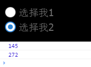

#Swan (UI库) 编程指南 - 单选按钮


单选按钮和复选框的区别在于，单选按钮不会单独使用，而是若干个单选按钮结成一组来使用，并且选择是排斥性的，如果你选择了A，那BCD则会自动切换到非选中状态。如果您的界面上，不止一组单选按钮，那么结组使用就更有必要了，并且必须保证不同的单选按钮组之间互不干扰。
创建一个单选按钮的方式非常简单：
``` TypeScript
var rdb:swan.RadioButton = new swan.RadioButton();
rdb.label = "选择1";
rdb.value =1;
this.addChild(rdb);
```

```
注意上面的value属性，您可以将您想附加的数据，设置在这个属性上，类型是不限的，可以是数字，字符串，甚至是一个自定义类型的对象都可以。
这样当用户选择了某一个单选按钮，您就可以直接取出它上面附加的数据来使用。
```
当然，一个单选按钮没有实际意义，我们来看看如何创建多个单选按钮并结组：

#### 方式1：使用groupName
``` TypeScript
private initRadioButton():void {
    var rdb: swan.RadioButton = new swan.RadioButton();
    rdb.label = "选择我1";
    rdb.value = 145;
    rdb.groupName = "G1";
    rdb.on(swan.UIEvent.CHANGE, this.radioChangeHandler, this);
    this.addChild(rdb);
    var rdb2: swan.RadioButton = new swan.RadioButton();
    rdb2.y = 30;
    rdb2.label = "选择我2";
    rdb2.value = 272;
    rdb2.selected = true;//默认选项
    rdb2.groupName = "G1";
    rdb2.on(swan.UIEvent.CHANGE, this.radioChangeHandler, this);
    this.addChild(rdb2);
}
private radioChangeHandler(evt:swan.UIEvent):void {
    lark.log(evt.target.value);
}
```
得到的效果：



这样的实现方式较为简单，但缺点是，如果想监视选项的变化，您需要在每个单选按钮上都添加egret.Event.CHANGE事件侦听。同样，如果您想得到最终选定的那个值，就必须循环判断，找到selected = true的那个单选按钮，取它的值。所以我们更推荐使用第二种方案：

#### 方式2：使用RadioButtonGroup
这种方式是，我们创建一个egret.gui.RadioButtonGroup的实例，并设置到每个单选按钮的group属性上。这样的好处在于，我们只需要处理RadioButtonGroup实例上的事件侦听，就能捕获数值的变化，要取得最终选择的那个值，也是从这个RadioButtonGroup实例上直接获取即可。示例代码：
``` TypeScript
private initRadioButtonWithGroup():void {
    var radioGroup: swan.RadioButtonGroup = new swan.RadioButtonGroup();
    radioGroup.on(swan.UIEvent.CHANGE, this.radioChangeHandler, this);
    var rdb: swan.RadioButton = new swan.RadioButton();
    rdb.label = "选择我1";
    rdb.value = 145;
    rdb.group = radioGroup;
    this.addChild(rdb);
    var rdb2: swan.RadioButton = new swan.RadioButton();
    rdb2.y = 30;
    rdb2.label = "选择我2";
    rdb2.value = 272;
    rdb2.selected = true;//默认选项
    rdb2.group = radioGroup;
    this.addChild(rdb2);
}
private radioChangeHandler(evt:swan.UIEvent):void {
    var radioGroup: swan.RadioButtonGroup = evt.target;
    lark.log(radioGroup.selectedValue);
}
```
实现的效果和方式1是一样的，但方式2代码上看着更清爽一些，如无特殊需求，我们建议尽量使用方式2。

下面为本章节使用到的皮肤组件代码，供您参考。

souce为图片路径，请替换成您的图片。

RadioButtonSkin.exml皮肤的代码如下：
``` XML
<?xml version="1.0" encoding="utf-8"?>
<s:Skin class="skins.RadioButtonSkin" states="up,down,disabled,upAndSelected,downAndSelected,disabledAndSelected" xmlns:s="http://ns.egret.com/swan">
    <s:Group width="100%" height="100%">
        <s:layout>
            <s:HorizontalLayout verticalAlign="middle"/>
        </s:layout>
        <s:Image fillMode="scale" alpha="1" alpha.disabled="0.5" alpha.down="0.7"
                 source="resource/assets/blue/RadioButton/radiobutton_unselect.png"
                 source.upAndSelected="resource/assets/blue/RadioButton/radiobutton_select_up.png"
                 source.downAndSelected="resource/assets/blue/RadioButton/radiobutton_select_down.png"
                 source.disabledAndSelected="resource/assets/blue/RadioButton/radiobutton_select_disabled.png"/>
        <s:Label id="labelDisplay" fontSize="20" textColor="0x707070"
                 textAlign="center" verticalAlign="middle"
                 fontFamily="Tahoma"/>
    </s:Group>
</s:Skin>
```
其中的 ```<s:Label id="labelDisplay"/>``` 表示单选按钮上的默认文本组件，如果不设置该id，将无法使用 radioButton.label="xxxx" 显示文本。
