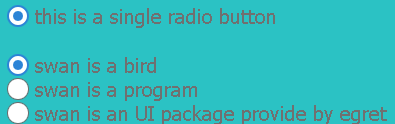
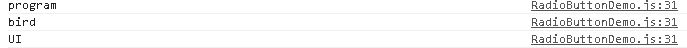

#Swan (UI库) 编程指南 - 单选按钮

单选框组件可以让用户在一组互相排斥的内容中做出一种选择。通过 swan.RadioButton 可以添加一个单选按钮。多个单选按钮可以指定一套单选按钮组 RadioButtonGroup ，在按钮组里用户每次只能选择一个 RadioButton 组件。

单选框组件继承自 ToggleButton 组件。可以使用 selected 属性以编程方式获取或设置此状态。当然他们都继承自 Button 组件，可以使用前几节 Button 组件的属性和方法。 

首先，我们准备好组件皮肤所需要的素材，如下图所示：


在项目中src目录下新建一个 skins 目录，存放我们的皮肤 skins/RadioButtonSkin.exml ,具体内容如下（图片资源已经在相应路径内）:

``` XML
<?xml version="1.0" encoding="utf-8"?>
<s:Skin class="skins.RadioButtonSkin" states="up,down,disabled,upAndSelected,downAndSelected,disabledAndSelected" xmlns:s="http://ns.egret.com/swan">
    <s:Group width="100%" height="100%">
        <s:layout>
            <s:HorizontalLayout verticalAlign="middle"/>
        </s:layout>
        <s:Image fillMode="scale" alpha="1" alpha.disabled="0.5" alpha.down="0.7"
                 source="resource/assets/blue/RadioButton/radiobutton_unselect.png"
                 source.upAndSelected="resource/assets/blue/RadioButton/radiobutton_select_up.png"
                 source.downAndSelected="resource/assets/blue/RadioButton/radiobutton_select_down.png"
                 source.disabledAndSelected="resource/assets/blue/RadioButton/radiobutton_select_disabled.png"/>
        <s:Label id="labelDisplay" fontSize="20" textColor="0x707070"
                 textAlign="center" verticalAlign="middle"
                 fontFamily="Tahoma"/>
    </s:Group>
</s:Skin>
```

接下来我们创建一个单选框，在程序中我们新建一个 RadioButtonDemo 类，并添加一个 myRadioButton。代码如下:

``` TypeScript
class RadioButtonDemo extends swan.Group {
   
   public constructor () {
        super();
    }
    private myRadioButton:swan.RadioButton = new swan.RadioButton(); //新建一个单选按钮
}
```

跟前面的章节一样，我们需要给组件指定皮肤才可以让他显示出来。我们可以在构造函数中使用skinName属性指定我们刚才准备好的皮肤资源。这里皮肤资源可以是外部文件，也可以是直接指定。若是外部文件资源可以监听其加载完成。修改上面的代码如下：

``` TypeScript
    public constructor () {
        super();
        this.myRadioButton.skinName = "skins/RadioButtonSkin.exml";  //指定外部皮肤
        this.myRadioButton.once(lark.Event.COMPLETE,this.loaded,this); // 监听皮肤加载完成事件
    }
    
    private loaded(e:lark.Event):void { //添加处理函数
        console.log(" myRadioButton skin is loaded"); 
        this.addChild(this.myRadioButton); //将单选按钮添加到显示列表当中.
    }
```

需要注意的是，我们的 RadioButtonDemo 类的实例需要被添加至舞台，具体可参见其他章节。编译运行项目我们可以看到 RadioButtonDemo 已经显示出来了。


同Button一样，我们可以指定其label属性，来添加一段描述性的文字。在以上 loaded 函数中添加如下代码，指定其描述文字.

``` TypeScript
    private loaded(e:lark.Event):void {
        console.log(" myRadioButton skin is loaded");
        this.myRadioButton.label = "this is a single radio button"; //添加描述lable文字描述
        this.addChild(this.myRadioButton);
    }
```

## 设置按钮组

单选按钮一般跟其他单选按钮组成一个按钮组，通过指定 groupName 属性来确定属于哪一个组。下面我们继续完善我们的 RadioButtonDemo 类。添加一个 myRadioButtonGroup 属性，并添加一个 myGroup() 方法，给他加入三个单选按钮。代码如下：

``` TypeScript
private loaded(e:lark.Event):void {

        console.log(" myRadioButton skin is loaded");
        this.myRadioButton.label = "this is a single radio button";
        this.addChild(this.myRadioButton);
        
        this.myGroup(); // 下一步 添加我的单选按钮组
    }

    private myRadioButtonGroup:swan.RadioButtonGroup = new swan.RadioButtonGroup(); //新建我的单选按钮组

    private myGroup():void{
    
        var skin = this.myRadioButton.skinName;         //使用上面的皮肤来完成下面的按钮

        var myRadioButton1:swan.RadioButton = new swan.RadioButton();
        myRadioButton1.label = "swan is a bird";
        myRadioButton1.skinName = skin;
        myRadioButton1.y = this.myRadioButton.y + this.myRadioButton.height +25;
        myRadioButton1.value = "bird";
        myRadioButton1.group = this.myRadioButtonGroup; //设置单选按钮组
        this.addChild(myRadioButton1);

        var myRadioButton2:swan.RadioButton = new swan.RadioButton();
        myRadioButton2.label = "swan is a program";
        myRadioButton2.skinName = skin;
        myRadioButton2.y = myRadioButton1.y + myRadioButton1.height;
        myRadioButton2.value = "program";
        myRadioButton2.group = this.myRadioButtonGroup;  //设置单选按钮组
        this.addChild(myRadioButton2);

        var myRadioButton3:swan.RadioButton = new swan.RadioButton();
        myRadioButton3.label = "swan is an UI package provide by egret";
        myRadioButton3.skinName = skin;
        myRadioButton3.y = myRadioButton2.y + myRadioButton2.height;
        myRadioButton3.value = "UI";
        myRadioButton3.group = this.myRadioButtonGroup;  //设置单选按钮组
        this.addChild(myRadioButton3);
    }

```

这样我们就得到了一组单选按钮，并设置成我的按钮组。可以跟上面的单选按钮 myRadioButton 对比一下，我们后来创建的单选按钮同一个按钮组里，只能单选一个按钮，而未设置按钮组的 myRadioButton 将不影响这一个组中的按钮，效果如下图：



添加完成之后我们也可以很容易的操作这些单选框，您可能注意到上面的代码里每一个单选框都设置了其value属性，下面我们通过监听按钮组的CHANGE事件可以很容易的获得其value值。

在上面的myGroup()里添加如下代码，监听其 CHANGE 事件：

``` TypeScript

 this.myRadioButtonGroup.on(lark.Event.CHANGE,this.onChange,this);
 
```

再添加onChange函数来处理，以上事件:

``` TypeScript
private onChange(e:lark.Event){              //在RadioButtonDemo类中添加
        console.log(e.target.selectedValue);  //通过RadioButtonGroup的selectedValue值来获取当前单选按钮的value值
    }
```

我们可以看到最终输出：



* 上一节 [复选框](7-4-checkbox.md)
* 下一节 [切换按钮](7-5-toggle.md)