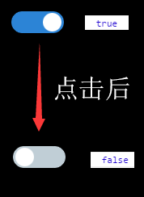
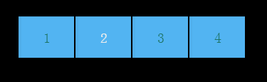

#Swan (UI库) 编程指南 - 状态切换按钮


ToggleButton，顾名思义就是一个具备状态的按钮，这个状态就是selected属性，类型是布尔量，默认为false，当您点击一下按钮，selected将变为true，再点击一下，重新变成false。在显示上也是有区别的，选中和非选中的外观是不一样的。

swan.ToggleSwitch 用来定义开关组件，包括一个开启和关闭状态的皮肤。它继承自 swan.ToggleButton ，可以使用 selected 来设置或获取其开关状态。

``` TypeScript
private initSwitch():void{
    var btn: swan.ToggleSwitch = new swan.ToggleSwitch();
    btn.label = "我是ToggleButton";
    btn.on(swan.UIEvent.CHANGE, this.changeHandler, this);
    this.addChild(btn);
}
private changeHandler(evt:swan.UIEvent) {
    lark.log(evt.target.selected);
}
```
得到的效果：



在下面的例子中，我们结合若干个ToggleButton，就可以实现类似TabBar这样的效果，如图所示：



``` TypeScript
private initToggleBar():void {
    for (var i: number = 0; i < 4; i++) {
        var btn: swan.ToggleButton = new swan.ToggleButton();
        btn.skinName = exml;
        btn.label = i + 1 + "";
        btn.y = 100;
        btn.width = 80;
        btn.height = 60;
        btn.x = 20 + i * 80;
        btn.on(swan.UIEvent.CHANGE, this.toggleChangeHandler, this);
        this.toggleBtns.push(btn);
        this.addChild(btn);
    }
}
private toggleChangeHandler(evt: swan.UIEvent) {
    for (var i: number = 0; i < this.toggleBtns.length; i++) {
        var btn: swan.ToggleButton = this.toggleBtns[i];
        btn.selected = (btn == evt.target);
    }
}
```


下面为本章节使用到的皮肤组件代码，供您参考。

souce为图片路径，请替换成您的图片。

ToggleSwitchSkin.exml皮肤的代码如下：
``` XML
<?xml version="1.0" encoding="utf-8"?>
<s:Skin class="skins.blue.ToggleSwitchSkin" states="up,down,disabled,upAndSelected,downAndSelected,disabledAndSelected" xmlns:s="http://ns.egret.com/swan">
    <s:Image source="resource/assets/blue/ToggleSwitch/on.png"
             source.up="resource/assets/blue/ToggleSwitch/off.png"
             source.down="resource/assets/blue/ToggleSwitch/off.png"
             source.disabled="resource/assets/blue/ToggleSwitch/off.png"/>
    <s:Image source="resource/assets/blue/ToggleSwitch/handle.png"
             horizontalCenter="-18"
             horizontalCenter.upAndSelected="18"
             horizontalCenter.downAndSelected="18"
             horizontalCenter.disabledAndSelected="18"
             verticalCenter="0"/>
</s:Skin>
```
ToggleButton.exml皮肤的代码如下：
``` XML
<?xml version="1.0" encoding="utf-8"?>
<s:Skin class="skins.ToggleButton" states="up,down,disabled,upAndSelected,downAndSelected,disabledAndSelected" xmlns:s="http://ns.egret.com/swan">
   <s:Image width="100%" height="100%" scale9Grid="1,3,8,8" source="resource/assets/blue/Button/button_up.png"
            source.down="resource/assets/blue/Button/button_down.png"/>
    <s:Label id="labelDisplay" fontSize="20" verticalCenter="0" horizontalCenter="0" textColor="0x1e7465"
                  textColor.down="0x1e7465" textColor.disabled="0xcccccc"
                  textColor.downAndSelected="0x1e7465" textColor.upAndSelected="0xeeedec"
                  textColor.disabledAndSelected="0xcccccc"  text="{label}"/>
</s:Skin>
```
其中的 ```<s:Label id="labelDisplay"/>``` 表示ToggleButton上的默认文本组件，如果不设置该id，将无法使用toggleButton.label="xxxx"显示文本。
