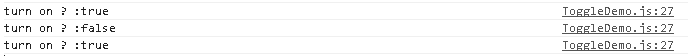

#Swan (UI库) 编程指南 - 切换按钮

swan.ToggleSwitch 用来定义开关组件，包括一个开启和关闭状态的皮肤。跟前一节一样，ToggleSwitch 也继承自 swan.ToggleButton ，可以使用 selected 来设置或获取其开关状态。

首先，我们准备好组件皮肤所需要的素材，如下图所示：


在项目中src目录下新建一个 skins 目录，存放我们的皮肤 skins/ToggleSwitchSkin.exml ,具体内容如下（图片资源已经在相应路径内）:

``` TypeScript
<?xml version="1.0" encoding="utf-8"?>
<s:Skin class="skins.ToggleSwitchSkin" states="up,down,disabled,upAndSelected,downAndSelected,disabledAndSelected" xmlns:s="http://ns.egret.com/swan">
    <s:Image source="resource/assets/blue/ToggleSwitch/on.png"
             source.up="resource/assets/blue/ToggleSwitch/off.png"
             source.down="resource/assets/blue/ToggleSwitch/off.png"
             source.disabled="resource/assets/blue/ToggleSwitch/off.png"/>
    <s:Image source="resource/assets/blue/ToggleSwitch/handle.png"
             horizontalCenter="-18"
             horizontalCenter.upAndSelected="18"
             horizontalCenter.downAndSelected="18"
             horizontalCenter.disabledAndSelected="18"
             verticalCenter="0"/>
</s:Skin>
```

接下来我们创建一个开关组件，在程序中我们新建一个 ToggleDemo 类，并添加一个 myToggleSwitcher。代码如下:

``` TypeScript
class ToggleDemo extends swan.Group{
    public constructor() {
        super();
    }
    private myToggleSwitcher: swan.ToggleSwitch = new swan.ToggleSwitch(); //新建一个开关
}
```
跟前面的章节一样，我们需要给组件指定皮肤才可以让他显示出来。我们可以在构造函数中使用 skinName 属性指定我们刚才准备好的皮肤资源。这里皮肤资源可以是外部文件，也可以是直接指定。若是外部文件资源可以监听其加载完成。修改上面的代码如下：

``` TypeScript
class ToggleDemo extends swan.Group{
    public constructor() {
        super();
        this.myToggleSwitcher.skinName = "skins/ToggleSwitchSkin.exml";  //加载上面的皮肤资源
        this.myToggleSwitcher.once(lark.Event.COMPLETE,this.loaded,this); //监听其加载完成s
    }
    private myToggleSwitcher: swan.ToggleSwitch = new swan.ToggleSwitch();

    private loaded():void{
        console.log(" myToggleSwitcher skin is loaded");  //皮肤资源加载完成 
        this.addChild(this.myToggleSwitcher);             //将我们的开关添加到显示列表中
    }
}
```

需要注意的是，我们的 ToggleDemo 类的实例需要被添加至舞台，具体可参见其他章节。编译运行项目我们可以看到 ToggleDemo 已经显示出来了。


跟其他ToggleButton一样，我们可以监听其 CHANGE 事件来获得 selected 的改变。在上面代码 loaded() 中添加监听：

``` TypeScript

this.myToggleSwitcher.on(lark.Event.CHANGE,this.onChange,this); //添加在loaded当中
 
```

添加处理函数，在 ToggleDemo 类里添加 onChange 函数，代码如下：

``` TypeScript
  private onChange(e:lark.Event):void {
        console.log("turn on ? :"+this.myToggleSwitcher.selected);
    }
```

这样我们就能获得其状态信息:



* 上一节 [单选按钮](7-5-radiobutton.md)
* 下一节 [滑动选择器](7-7-slider.md)
