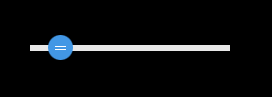

#Swan (UI库) 编程指南 - 滑动选择器

您还记得手机上的亮度调节工具吗？在swan中也有类似的组件，就是滑块控件。这个实际上是两个组件，根据方向，分为swan.HSlider 水平滑块控件和 swan.VSlider 垂直滑块控件。

#### 水平滑块控件
``` TypeScript
private initHSlider():void {
    var hSlider: swan.HSlider = new swan.HSlider();
    hSlider.width = 200;
    hSlider.x = 20;
    hSlider.y = 20;
    hSlider.minimum = 0;//定义最小值
    hSlider.maximum = 100;//定义最大值
    hSlider.value = 10;//定义默认值
    hSlider.on(swan.UIEvent.CHANGE, this.changeHandler, this);
    this.addChild(hSlider);
}
private changeHandler(evt: swan.UIEvent): void {
    lark.log(evt.target.value);
}
```
得到的效果：



#### 垂直滑块控件
``` TypeScript
private initVSlider():void {
  var vSlider: swan.VSlider = new swan.VSlider();
  vSlider.height = 200;
  vSlider.x = 100;
  vSlider.y = 60;
  vSlider.minimum = 100;//定义最小值
  vSlider.maximum = 200;//定义最大值
  vSlider.value = 120;//定义默认值
  vSlider.on(swan.UIEvent.CHANGE, this.changeHandler, this);
  this.addChild(vSlider);
}
private changeHandler(evt: swan.UIEvent): void {
    lark.log(evt.target.value);
}
```
得到的效果：


下面为本章节使用到的皮肤组件代码，供您参考。

souce为图片路径，请替换成您的图片。

HSliderSkin.exml皮肤的代码如下：
``` XML
<?xml version="1.0" encoding="utf-8"?>
<s:Skin class="skins.HSliderSkin" minWidth="20" minHeight="8" xmlns:s="http://ns.egret.com/swan">
    <s:Image id="track" source="resource/assets/blue/Slider/track.png" scale9Grid="1,1,4,4" width="100%"
             height="6" verticalCenter="0"/>
    <s:Image id="thumb" source="resource/assets/blue/Slider/thumb.png" verticalCenter="0"/>
</s:Skin>
```
VSliderSkin.exml皮肤的代码如下：
``` XML
<?xml version="1.0" encoding="utf-8"?>
<s:Skin class="skins.VSliderSkin" minWidth="25" minHeight="30" xmlns:s="http://ns.egret.com/swan">
    <s:Image id="track" source="resource/assets/blue/Slider/track.png" scale9Grid="1,1,4,4" width="7" height="100%" horizontalCenter="0"/>
    <s:Image id="thumb" source="resource/assets/blue/Slider/thumb.png" horizontalCenter="0" />
</s:Skin>
```
其中的 ```<s:Image id="track"/>``` 表示横向或者纵向的滑动轨道。

其中的 ```<s:Image id="thumb"/>``` 表示轨道上的滑块。

如果不设置它们，将无法拖动滑块或者设置value定位滑块。
