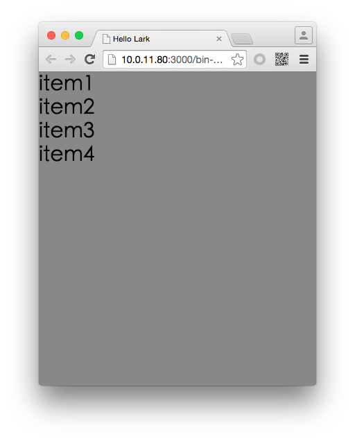
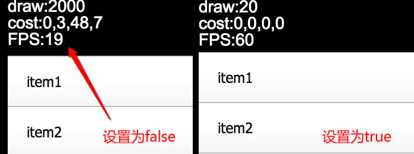

#Swan (UI库) 编程指南 - 数据容器

DataGroup，可以直译为"数据容器"。但叫"容器"又不太严谨，因为您不能将它当做普通容器来用，直接创建按钮什么的往里面添加是不行的，正确的做法是给它设置一个数据源，然后它自动创建内部所需的对象，来完成数据展示。也就是说，如果您要干预数据容器的显示，只能通过干预数据来实现，数据变了，显示就会变。

那么它是怎么实现这种"数据绑定+展示"的过程呢？如果您之前做过前端开发，应该对"模板"这种机制不陌生。假设有10条数据，需要用列表标签

```
<ul></ul>
```

显示出来，您所需要做的就是定义一条

```
<li>
```

的格式，至于数据条数就不是问题了，那是循环要解决的事情。

```
//伪代码
<ul>
    <%for(data each collection)%>
    <li><a href="{data.link}">{data.label}</a></li>
    <%end for%>
</ul>
```

对于 DataGroup 而言，也是类似的道理。您除了设置数据源，还要设置单条数据的"模板"。这个"模板"，在swan 框架中称之为 ItemRenderer。
,
来看看一个DataGroup的例子，首先创建数据源：

``` TypeScript
//先创建一个数组
var sourceArr:any[] = [];
for (var i:number = 1; i < 5; i++) {
    sourceArr.push({label:"item"+i});
}
//用ArrayCollection包装
var myCollection:swan.ArrayCollection = new swan.ArrayCollection(sourceArr);
```

然后创建DataGroup的实例，并设置数据源(属性名称是dataProvider)：

``` TypeScript
var dataGroup:swan.DataGroup = new swan.DataGroup();
dataGroup.dataProvider = myCollection;
dataGroup.percentWidth = 100;
dataGroup.percentHeight = 100;
this.addChild(dataGroup);
```

写到这里直接编译运行会发生什么？当然是什么都看不到的。我们还有两个重要的工作没有做，一个是创建 ItemRenderer，一个设置 ItemRenderer 的样式。

**创建ItemRenderer**

``` TypeScript
class LabelRenderer extends swan.ItemRenderer {
	private labelDisplay:swan.Label;
    public constructor(){
        super();
        this.touchChildren = true;

        this.labelDisplay = new swan.Label();
        this.addChild( this.labelDisplay );
    }
    protected dataChanged():void{
        this.labelDisplay.text = this.data.label;
    }
}
```

注意两点：

1. 自定义的ItemRenderer，应该继承 swan.ItemRenderer，然后在内部添加自定义的功能
2. 将数据对应到显示的语句，应该放在 dataChanged方法中，当数据改变并且皮肤已经创建完毕的情况下这个方法会被执行。这样的好处是，保证您调用的皮肤部件一定是实例化完成的。

然后我们将自定义的 LabelRenderer 类赋值给 itemRenderer 属性：

``` TypeScript
dataGroup.itemRenderer = LabelRenderer;
```


再编译就能看到显示效果了：



完整代码如下：

Main.ts

``` TypeScript
class DataGroupDemo extends swan.Group {
    public constructor() {
        super();
    }
    protected createChildren():void {
        //先创建一个数组
        var sourceArr:any[] = [];
        for (var i:number = 1; i < 5; i++){
        	//给数据中添加一个含有"label"属性的对象
            sourceArr.push({label:"item"+i});
        }
        //用ArrayCollection包装
        var myCollection:swan.ArrayCollection = new swan.ArrayCollection(sourceArr);

        var dataGroup:swan.DataGroup = new swan.DataGroup();
        dataGroup.dataProvider = myCollection;
        dataGroup.percentWidth = 100;
        dataGroup.percentHeight = 100;
        this.addChild(dataGroup);

        dataGroup.itemRenderer = LabelRenderer;
    }
}
```

LabelRenderer.ts

``` TypeScript
class LabelRenderer extends swan.ItemRenderer {
	private labelDisplay:swan.Label;
    public constructor(){
        super();
        this.touchChildren = true;
        this.labelDisplay = new swan.Label();
        this.addChild( this.labelDisplay );
    }
    protected dataChanged():void{
    	//显示数据中的 label 值
        this.labelDisplay.text = this.data.label;
    }
}
```
**如何给 ItemRenderer 设置皮肤，请看后面的[自定义项呈示器](9-5-ItemRenderer.md)章节**

###大数据优化
DataGroup 中有一个属性 useVirtualLayout，默认为 true，这个属性决定了列表创建内部对象的策略：
**策略1**
useVirtualLayout = false;
有多少条数据就创建多少个 ItemRenderer 的实例
**策略2**
useVirtualLayout = true;
**一般配合 [Scroller](8-4-scroller.md) 使用。**
DataGroup 会根据组件的尺寸，计算同时最多能显示多少个组件，根据这个数字创建一组 ItemRenderer 并循环使用。当您滚动切换数据的时候，只是这一组 ItemRenderer 循环切换自己的位置和显示，这个过程是顺畅的无缝衔接的。

举个例子，比如 ItemRenderer 的高度是10，DataGroup 的高度是100，DataGroup 的 dataProvider 中有1000条数据。这种情况下，DataGroup 中只会创建 11 个 ItemRenderer 的实例，当您向下滚动 DataGroup 的时候，移出舞台的那个 ItemRenderer 会自动移到最顶端，根据下一条数据改变自己的样式，而不需要再创建一个新的实例。

显然策略2在数据量大的时候，会具备更好的性能优势。假设您有上千条数据，用策略1的话，界面估计就卡死了，而用策略2的话就不存在这个问题，因为数据量的增加，并不会导致显示对象数量的增加，也不会导致重绘次数的增加。

1000条数据的对比图


我们在前面 Group 容器章节中提到过，swan 的容器类比 lark.Sprite 多2个方法： getElementAt  和 numElements，他们和 getChildAt 和 numChildren 有什么区别呢？
**在策略1的情况下**
两个完全是相同的
numElements 和 numChildren 都会获得相同的实例数量
getElementAt 和 getChildAt 获取的对象也是相同的
**在策略2的情况下**
numChildren 会获得具体的实例数量，而 numElements 会获得总的数据条数。
还用之前那个例子，ItemRenderer 的高度是10，DataGroup 的高度是100，DataGroup 的 dataProvider 中有1000条数据。
numChiild 获得的数量是11，而 numElements 获得的数量是 1000。
getChildAt 可以在0-10的索引中获取具体的实例对象
getElementAt 可以在0-999的索引中获取虚拟布局中的元素
