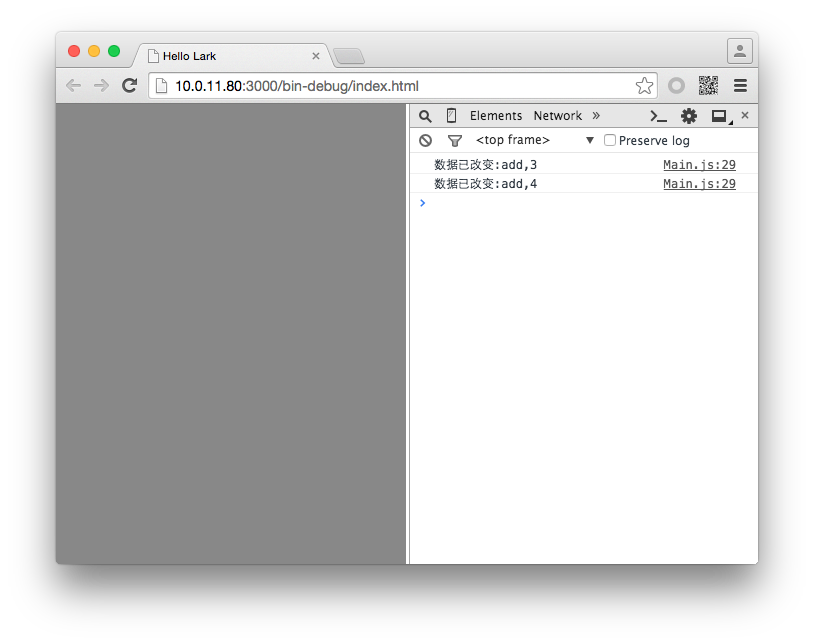
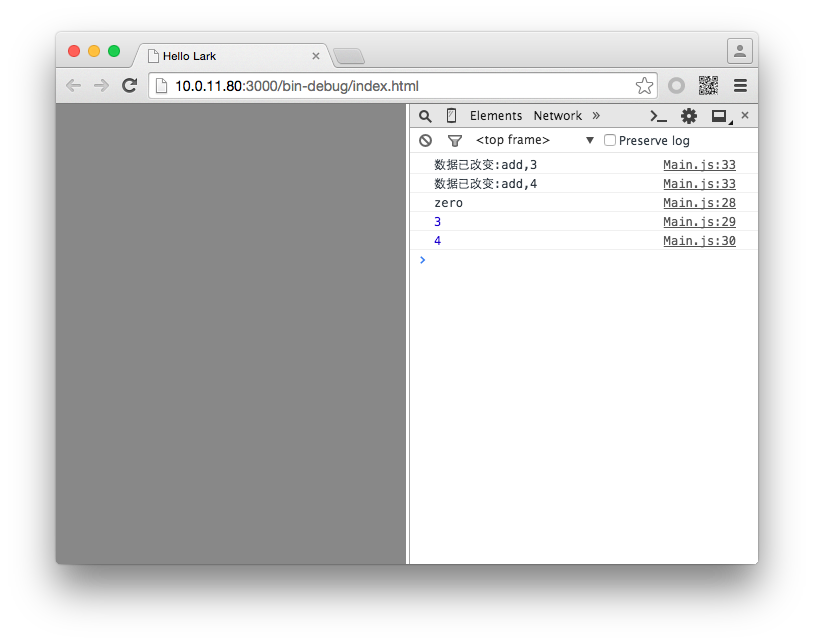

#Swan (UI库) 编程指南 - 数组集合


ArrayCollection 是 swan 中专用的一个数据封装类。一个典型的数据展示组件的设计思路是，组件和数据相分离，给组件一个数据源，组件就按预定的方式把数据展示出来。在很多不同语言的框架中，都能看到类似的实现方式。

对于 DataGroup 、 List 这种类型的组件，它的数据源其实就是需要一个"数组"。那为什么不用 TypeScript 中的数组直接作为这类组件的数据源呢？因为普通的数组没有派发事件的能力，当数组内的数据被修改了(增删改)，组件却无法有效的获知，也无法及时更新视图上的显示内容。为了解决这个问题，swan 框架需要将数组再做一层封装，做一些功能上的增强。这就是为什么要引入 ArrayCollection。

来看看如何创建一个 ArrayCollection:

``` TypeScript
//先创建一个数组
var sourceArr:any[] = [{name:"one",value:1},{name:"two",value:2}];
//用 ArrayCollection 包装
var myCollection:swan.ArrayCollection = new swan.ArrayCollection(sourceArr);
```

**也可以不创建数组，直接使用new swan.ArrayCollection()，这样将在内部默认创建一个空数组**

封装的最大意义在于事件，您可以在 ArrayCollection 上添加事件侦听，每当数据改变时，您就可以获取消息：

``` TypeScript
//当数据改变的时候，ArrayCollection 会派发事件
myCollection.on(swan.CollectionEvent.COLLECTION_CHANGE,this.collectionChangeHandler,this);
```

``` TypeScript
private collectionChangeHandler(evt:swan.CollectionEvent):void {
    console.log("数据已改变:"+evt.kind+","+evt.target.length);
}
```

然后我们给ArrayCollection添加数据，来看看事件侦听的效果：

``` TypeScript
var itemData:Object = {name:"three",value:3};
myCollection.addItem(itemData);//相当于push
myCollection.addItemAt({name:"zero",value:0},0);//添加的指定的索引位置
```

编译并运行，效果如图：



如果要获取ArrayCollection中的数据，可以这样：

``` TypeScript
console.log(myCollection.getItemAt(0).name);//根据索引位置获取某一项数据
console.log(myCollection.getItemIndex(itemData));//获取某一项数据所在的索引值
console.log(myCollection.length);//获取数组长度
```

编译并运行，效果如图：



如果要替换某一项数据，可以：

``` TypeScript
myCollection.replaceItemAt({name:"zero",value:-1},0);
```

做删除操作，可以这样：

``` TypeScript
myCollection.removeItemAt(0);//删除某一个
myCollection.removeAll();//全部删除
```

完整代码如下：

``` TypeScript
class Main extends swan.Group {
    public constructor() {
        super();
    }
    protected createChildren():void {
        //先创建一个数组
        var sourceArr:any[] = [{name:"one",value:1},{name:"two",value:2}];
        //用ArrayCollection包装
        var myCollection:swan.ArrayCollection = new swan.ArrayCollection(sourceArr);

        //当数据改变的时候，ArrayCollection会派发事件
        myCollection.on(swan.CollectionEvent.COLLECTION_CHANGE,this.collectionChangeHandler,this);

        var itemData:Object = {name:"three",value:3};
        myCollection.addItem(itemData);//相当于push
        myCollection.addItemAt({name:"zero",value:0},0);//添加的指定的索引位置

        myCollection.replaceItemAt({name:"zero",value:-1},0);

        //获取
        console.log(myCollection.getItemAt(0).name);//根据索引位置获取某一项数据
        console.log(myCollection.getItemIndex(itemData));//获取某一项数据所在的索引值
        console.log(myCollection.length);//获取数组长度

        myCollection.removeItemAt(0);//删除某一个
        myCollection.removeAll();//全部删除
    }

    private collectionChangeHandler(evt:swan.CollectionEvent):void {
        console.log("数据已改变:"+evt.kind+","+evt.target.length);
    }
}
```
