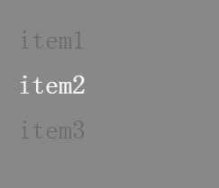
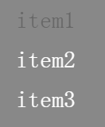

#Swan (UI库) 编程指南 - 列表


列表组件 List ，继承自 DataGroup，它和 DataGroup 的区别在于：
* 在 List 中选中一项，会触发 swan.ItemTapEvent.ITEM_TAP 事件，然后您就可以执行后续的逻辑处理
* List有选中项的概念，可以设置 List 中的默认选中项。

下面来看看List的基本用法：
``` TypeScript
class Main extends swan.Group {
    constructor() {
        super();
    }
    private list:swan.List;
    protected createChildren() {
        super.createChildren();
        var exml = `
        <s:Skin xmlns:s="http://ns.egret.com/swan" states="up,down" height="50">
            <s:Label text="{data}" textColor.down="0xFFFFFF" textColor.up="0x666666" horizontalCenter="0" verticalCenter="0"/>
        </s:Skin>`;
        var list = new swan.List();
        list.dataProvider = new swan.ArrayCollection(["item1","item2","item3"]);
        list.itemRendererSkinName = exml;
        this.addChild(list);
        this.list = list;
        list.selectedIndex = 1;//设置默认选中项
        list.on(swan.ItemTapEvent.ITEM_TAP,this.onChange,this);
    }
    private onChange(e:swan.PropertyEvent):void{
    	//获取点击消息
        console.log(this.list.selectedItem,this.list.selectedIndex)
    }
}
```
效果如下：

~~~
设置默认选中项
list.selectedIndex = 1;
~~~
~~~
获取当前选中项的信息
list.selectedItem
list.selectedIndex
~~~
### 多选状态
 List 还可以开启多选状态
~~~ TypeScript
list.allowMultipleSelection = true;
~~~
效果如下：

多选状态下，List 中所有的条目都可以被选中，再次点击选中的条目则会取消选中，恢复原状。

此时监听 swan.ItemTapEvent.ITEM_TAP 事件，可以通过下面两个属性获得一个数组，里面包含了当前哪些条目处于选中状态：
~~~
list.selectedIndices
list.selectedItems
~~~
在多选状态下还有一个命令可以配合使用：
~~~ TypeScript
list.requireSelection = true;
~~~
该属性设置为 true 后，多选状态下最少有一个条目会被选中，不可以被取消。