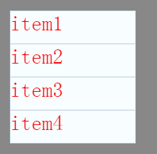

#Swan (UI库) 编程指南 - 自定义项呈示器

前面的章节我们介绍了 DataGroup 和 List，你会发现里面都用到了 ItemRenderer 。它的作用实际上就是根据数据源，把当前的数据可视化的显示出来。ItemRenderer 中有一个默认的属性 data ，引擎会自动把通过 dataProvider 设置的的数据赋值给 data。
我们用一段代码来举例,

~~~ TypeScript
class ItemRendererDemo extends swan.Group {
    public constructor() {
        super();
    }
    protected createChildren():void {
        //先创建一个数组
        var sourceArr:any[] = [];
        for (var i:number = 1; i < 5; i++){
        	//给数据中添加一个含有"label"属性的对象
            sourceArr.push({label:"item"+i});
        }
        //用ArrayCollection包装
        var myCollection:swan.ArrayCollection = new swan.ArrayCollection(sourceArr);

        var dataGroup:swan.DataGroup = new swan.DataGroup();
        dataGroup.dataProvider = myCollection;
        this.addChild(dataGroup);

        var exml = `
        <s:Skin xmlns:s="http://ns.egret.com/swan">
            <s:Image source="resource/assets/Panel/border.png"/>
            <s:Label textColor="0xfd0000" text="{data.label}"/>
        </s:Skin>`;

        dataGroup.itemRenderer = LabelRenderer;
        //dataGroup.itemRendererSkinName = exml;//也可以直接设置 exml 文件做为 ItemRenderer
    }
}
~~~
``` TypeScript
class LabelRenderer extends swan.ItemRenderer {
	private labelDisplay:swan.Label;
    public constructor(){
        super();
        //自定义的 ItemRenderer
        this.touchChildren = true;
        var bg = new swan.Image("resource/assets/Panel/border.png");
        this.labelDisplay = new swan.Label();
        this.labelDisplay.textColor = 0xfd0000;
        this.addChild( this.labelDisplay );
    }
    protected dataChanged():void{
    	//数据改变时，会自动调用 dataChanged 这个方法
        //显示数据中的 label 值
        this.labelDisplay.text = this.data.label;
    }
}
```
显示效果：

在上面的代码示例中，继承自 swan.ItemRenderer 的 LabelRenderer 类中，有一个文本行 labelDisplay 。
当数据改变时，会自动调用 dataChanged 这个方法，然后 labelDisplay 会把我们想要显示的数据 **this.data.label** 显示出来。

如果您的 ItemRenderer 类中只是显示皮肤，没有自定义的逻辑方法。您完全可以不创建自定义的 ItemRenderer 类，而通过 dataGroup.itemRendererSkinName 这个方法直接使用 exml 描述文件来实现皮肤显示和数据绑定。显示效果完全相同，还可以少写一个类文件。

另外，像上面这个创建显示 DataGroup 的示例，也完全可以用一个 exml 文件实现，不需要写这么多代码。
~~~ TypeScript
class ItemRendererDemo extends swan.Group {
    constructor() {
        super();
    }
    protected createChildren() {
        super.createChildren();
        var exml = `
        <s:Skin xmlns:s="http://ns.egret.com/swan">
            <s:DataGroup>
                <s:itemRendererSkinName>
                    <s:Skin>
                        <s:Image source="resource/assets/Panel/border.png"/>
                        <s:Label textColor="0xfd0000" text="{data.label}"/>
                    </s:Skin>
                </s:itemRendererSkinName>
                <s:ArrayCollection>
                    <s:Array>
                        <s:Object label="item1"/>
                        <s:Object label="item2"/>
                        <s:Object label="item3"/>
                        <s:Object label="item4"/>
                    </s:Array>
                </s:ArrayCollection>
            </s:DataGroup>
        </s:Skin>`;
        var component = new swan.Component();
        component.skinName = exml;
        this.addChild(component);
    }
}
~~~
